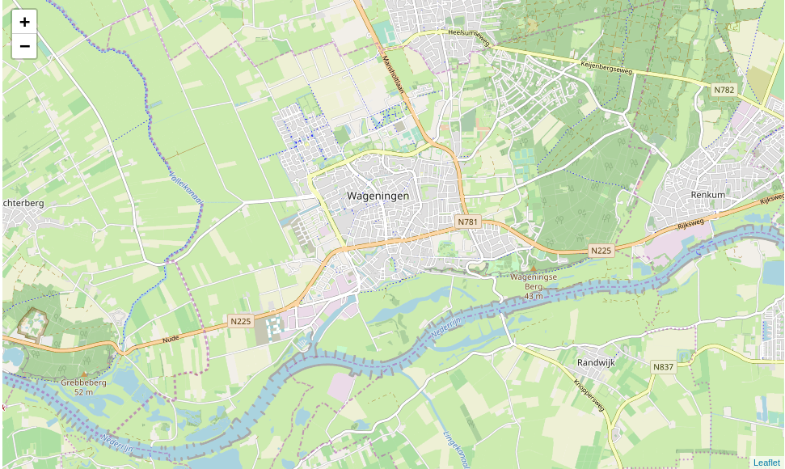
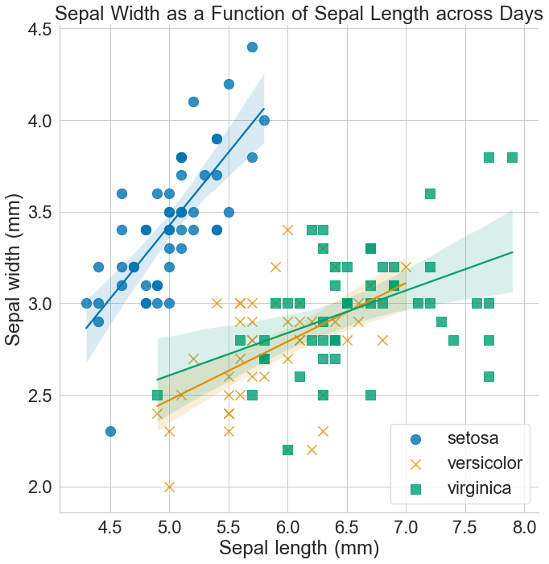
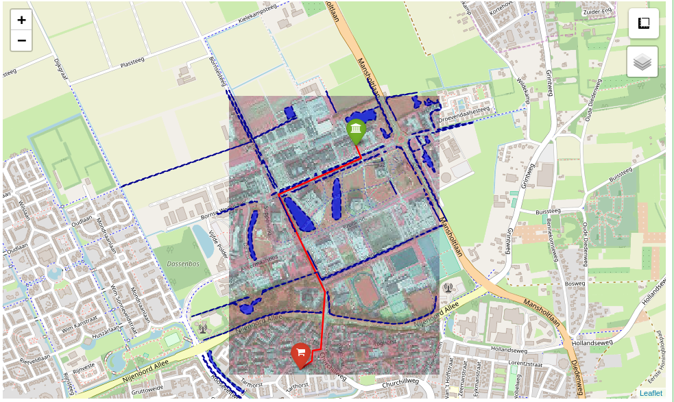

# [WUR Geoscripting](https://geoscripting-wur.github.io/) 

# "Week 3: Python for Geo-scripting"

Good morning! Today we will start working with Python for Geo-scripting and do a refresher of functions in Python. 

### Today's schedule

- Follow [Intro to Python for Data Science course in Datacamp](https://www.datacamp.com/courses/intro-to-python-for-data-science) 
- Get Introduced to Python Environment
- Learn how to work with virtual environments: Conda
- Learn how to create a Jupyter Notebook
- Refresh Python programming knowledge
- Check a nice example of a Jupyter Notebook


## Follow Intro to Python course on Datacamp 
Datacamp has courses on R, Python and SQL. Most popular modules in Python are covered in Datacamp too. As assignment for today, you will have to finish the [introduction to Python Datacamp course](https://www.datacamp.com/courses/intro-to-python-for-data-science).

## Introduction to Python Environment
Python is a jack-of-all-trades programming language, that is free, flexible, open-source, cross-platform and has a very large community behind it. If you ask Python programmers what they like most about Python, they will often cite its high readability and high availability of good packages. There is a lot of powerful Python packages out there for geo-scripting, data wrangling, visualization and machine learning. For example:

* Geo Scripting
    * GeoPandas (Vector Processing)
    * RasterIO (Raster Processing)
    * GDAL/OGR (Vector and Raster Processing)
    * QGIS plugins (Open Source GIS)
    * ArcPy (Propietary GIS)
* Data Handling
    * Pandas (Dataframes and Data Analysis)
    * Numpy (Scientific Computing)
* Visualization
    * Matplotlib (General Graphics)
    * Seaborn (Statistical Graphics)
    * Folium (Interactive Maps)
* Machine Learning
    * TensorFlow (Deep Learning)
    * Keras (Deep/Machine Learning)
    * Scikit-Learn (Machine Learning)


### Python editors and IDEs
There are a number of Integrated Development Environments [IDE] for Python. An IDE is a software application that provides facilities for software development.

* [Spyder](https://www.spyder-ide.org/) is a nice lightweight IDE. In the Geo-scripting course Spyder is recommended as the Python IDE.
* [Jupyter Notebook](http://jupyter.org/) integrates visualizations together with code and is highly suitable to make tutorials or simple dashboards. Jupyter Notebooks run in your browser on a localhost server or on a web server. Jupyter Notebooks are nice to make quick visualizations and do prototype testing. It allows different programming languages. You can have a Python, R, Julia, Spark or PySpark kernel in the notebook. Today the Jupyter Notebook with a Python kernel will be used and explained. 
* [PyCharm Community Edition](https://www.jetbrains.com/help/pycharm/install-and-set-up-pycharm.html) is a free professional Python IDE with a lot of advanced functionality, such as integrated GIT version control, code completion, code checking, debugging and navigation. This IDE can optionally be used by more advanced scripters during the Geo-scripting course instead of Spyder, but do know there won't be support for it since the focus of Geo-scripting is on learning to script.


### Python package management
A set of tools co-exist for installing and managing packages. It is possible to install packages on your base Python interpreter, but sooner or later you will get conflicting Python packages since packages have varying dependencies. It can even [break your system Python interpreter](https://askubuntu.com/questions/95037/what-is-the-best-way-to-install-python-packages). So instead per project an environment is created on your local machine, where Python packages can be installed and organized. For each project it is recommended to make a new environment. Another way to handle conflicting Python packages is with the distribution package manager of Ubuntu. The available Python packages of the distribution manager have been tested to work together, but some cons are that it does not have all packages and sometimes has outdated packages. There are three recommended ways to install packages, which we list below sorted from most preferred to less preferred:

* Using [conda](https://conda.io/docs/user-guide/tasks/manage-pkgs.html) to install packages and to keep separate sets of packages. A set of of packages in _Conda_ is called a conda environment. _Conda_ is available for Windows, macOS and Linux. In the conda environments basically anything, such as software, C libraries or R packages, can be installed.
* Using _pip_ to install packages and _conda_ to manage packages. _Pip_ is available for Windows, macOS and Linux. Pip sometimes is the better way to install packages and can install [binary wheels on Windows](https://www.lfd.uci.edu/~gohlke/Pythonlibs).
* Using the distribution's package manager (only on Ubuntu, that's `sudo apt-get install python-*`).

#### Conda installation
Conda can be downloaded in two versions: Anaconda and Miniconda. The difference is that Miniconda is just shipping the repository management system. So when it is installed, you will only have the management system without packages. Whereas with Anaconda, you get the distribution with most popular Python packages already built in. 
In Geo-scripting Miniconda is used. To install Miniconda in your Linux environment, we have prepared a short _Bash_ script for you. Just run the following lines of code, line by line, in a new terminal window.

```{r, eval=FALSE, engine='bash'}
MINICONDA_VERSION="Miniconda3-latest-Linux-x86_64"
pushd /tmp
curl -O https://repo.continuum.io/miniconda/${MINICONDA_VERSION}.sh
## This installation script will require user input
bash ${MINICONDA_VERSION}.sh
rm ${MINICONDA_VERSION}.sh
popd
```

Scroll down the license with enter. Accept License (i.e. type yes). Use default install location (i.e. press Enter). When prompted to prepend the Conda install location to path agree (i.e. type yes). This makes the Python interpreter of Conda the standard Python interpreter and allows you to run Conda commands from command line. Finally, restart your terminal to be able to use conda in the terminal.

#### Conda usage
Go to your terminal and type in:

```{r, eval=FALSE, engine='bash'}
conda search spyder
```

This gives a list of all packages that have "Spyder" in the name and lists all available versions. To install:

```{r, eval=FALSE, engine='bash'}
conda install spyder
```

This would install the latest version of the _Spyder_ package (Python IDE). Note that this would install it into your user's root virtual environment (by default it is `$HOME/miniconda3`). Conda creates isolated environments with sets of packages, that do not interfere with your base Python or with other conda environments. To create an environment:

```{r, eval=FALSE, engine='bash'}
conda create --name geotest python=2.7 numpy
```

This would create a new environment called _geotest_ with Python 2.7 and _NumPy_ installed into the conda environment. To list the available environments:

```{r, eval=FALSE, engine='bash'}
conda info --envs
```

Conda puts an asterisk (*) in front of the active environment. To activate the environment:

```{r, eval=FALSE, engine='bash'}
## Cross-platform
conda activate geotest
## Linux, macOS
source activate geotest
## Windows
activate geotest
```

After this, the current environment is shown in (parentheses) in front of your prompt (`(geotest)$`). Note that the activated environment is only valid for the shell in which you activated it. For instance, if you close the shell window and open a new one you will have to activate it again. If you want to install a new package and are inside the conda environment, the package is installed simply with conda or pip. Generally, installing with conda is recommended. In the documentation of most Python packages the recommended way to install can be found.

```{r, eval=FALSE, engine='bash'}
conda install geopandas pandas
pip install rasterio rasterstats
```

Removing is just as simple.

```{r, eval=FALSE, engine='bash'}
conda remove geopandas pandas
pip uninstall rasterio rasterstats
```

Now deactivate the environment and return to base environment.

```{r, eval=FALSE, engine='bash'}
## Cross-platform
conda deactivate
## Linux, macOS
source deactivate
## Windows
deactivate
```

Since Python 2.7 is outdated and we want to work with Python 3, we can remove the environment _geotest_.

```{r, eval=FALSE, engine='bash'}
conda remove --name geotest --all
```

In addition, as you saw with Spyder install, Conda is able to install some non-Python packages that have Python bindings, such as Spyder and GDAL. This is useful for making sure your Python and binary versions match and do not interfere with the system-wide ones.
Some extra helpful utilities are:

* `conda list` to check which packages are installed in _root_ or in the active environment;
* `python --version` or `gdal-config --version` to check which Python or GDAL version is used in the environment;
* `which spyder` or `type spyder` to find out which Spyder executable is used either from system or conda environment.


## Running Python in terminal

For quick testing, Python can be started from terminal in Linux. Open a new terminal and type one of the lines with Python below.

```{r, eval=FALSE, engine='bash'}
python
# or 
python2
# or 
python3
```

Test this script and find out what your Python version is inside Python.

```{Python, eval=FALSE, engine.path='/usr/bin/Python3'}
import sys
print('Good morning, you are running Python:', sys.version)
```

Okay enough fooling around. Time for some proper IDEs. Exit Python in the terminal to return to your normal terminal.
```{Python, engine.path='/usr/bin/Python3', eval=FALSE}
exit()
# or 
quit()
```

## Running Python in Jupyter Notebooks

Jupyter Notebooks make coding in Python much easier and allow for nice integrated visualizations. Try the following commands in your terminal to create a conda environment for todays tutorial with Jupyter Notebook:

```{r, eval=FALSE, engine='bash'}
conda create -n geoscripting numpy jupyter geopandas
conda activate geoscripting
conda install --channel conda-forge folium
```

Sometimes packages are not directly available from the standard conda channels, but require a specific conda channel, such as conda-forge. The documentation of Python packages often show the recommended conda channel to install the Python package.

Time to run the Jupyter Notebook.

```{r, eval=FALSE, engine='bash'}
cd #reset working environment to default location
jupyter notebook
```

If everything goes according to plan, Jupyter will pop up in your browser. You will see a menu with all the files in your working directory. The Jupyter Notebook will only see files that are accessible from the working directory in which you launched the notebook!

Go to documents. Make a new folder: *New* → *Folder*, rename the folder and create new Python3 Jupyter Notebook *New* → *Python 3*. Give your notebook a name by clicking on *untitled*. Feel free to have a go at the user interface tour: *Help* → *User Interface Tour*.

Hover over the toolbar to check out all tools. These are the basic tools you will need today:

- _Save and checkpoint_
- _Insert cell below_
- _Run_
- _Code/Markdown/Heading_ (List box)

Similar to RMarkdown, Jupyter Notebooks have code cells (*Code*) and text cells (*Markdown*). Insert some extra cells by clicking the + button and change the first cell from code to markdown. Enter some documentation for your code (e.g. your team name, exercise and date). Leave the other cells on code. Type the following Python code in a code cell:

```{Python, engine.path='/usr/bin/Python3', eval=FALSE}
import folium
m = folium.Map(location=[51.9700000, 5.6666700], zoom_start=13)
m
```



Run the code in a code cell, select it and press the *Run* button, or press *CTRL + Enter* or *Shift + Enter*. Wow! Try and drag the map to play around with it. Nice map :) 


## Python refresher

Additionally in this tutorial we will do a quick Python refresher.

```{block type="alert alert-info"}
**Protip**: Python has a specific way of doing things. It is called the [Pythonic way](https://docs.python-guide.org/writing/style/) and stands for simple readable code.
```

### Looking for help

If you are looking for help while programming in Python, there are several ways to find help. Usually googling solves your problem the quickest, because it finds answers on multiple platforms, such as StackOverflow and Github. During Geo-scripting we have the forum to ask and give help. Asking your friends or colleagues in person is also a great way to learn and fix programming problems. Another good option is get documentation from the package website or inside Python.

```{Python, engine.path='/usr/bin/Python3'}
import sys
help(sys)
```

See how the functions in the `sys` package got listed.

```{block, type="alert alert-success"}
> **Question** 1: What does this mean `__ __` around words: e.g: `__doc__`?

```


### Numbers and variables


```{Python, engine.path='/usr/bin/Python3'}
print(int(10.6))
```

```{block, type="alert alert-success"}
> **Question 2**: What is the difference between 10 and 10.0 when dealing with data types in Python?
```

Variable is a storage location or symbolic name to a value e.g.:

```{Python, engine.path='/usr/bin/Python3'}
building = 'Gaia'
buildingNumber = 101
building + ' is in Wageningen'
```

There is no need to define the datatype, `Python` has a loose datatype variable declaration. Python is basically a list of objects.


### Lists
Now we will have a go with lists.

```{block type="alert alert-info"}
**Protip**: Variables, functions, classes and methods that you define in one of your Jupyter Notebook cells can be used in other cells too.
```

Run this code in one cell.
```{Python, engine.path='/usr/bin/Python3'}
campus = ['Gaia', 'Lumen', 'Radix', 'Forum']
# how can we print Forum?
print(campus[3])
# how to access the end of the list (while having no idea how big it is)
print(campus[-1])
# how to access the first 3 items
print(campus[0:3])
```

Play around with this code in another cell. We will do some appending, inserting, extending and steps:
```{Python, engine.path='/usr/bin/Python3'}
campus.append("Atlas")
campus.insert(1,"SoilMuseum")
campus.extend(["Action", "Vitae", "Zodiac"])
print(campus)
print(campus[::2])
```

See how the notebook remembered how you set the variable `campus`. 

```{block, type="alert alert-success"}
> **Question 3:** What are the major differences between Append/Extend?
```

```{block, type="alert alert-success"}
> **Question 4:** What building is `campus[-2]`?
```

### Dictionaries, loops, if/else

Let there be dictionaries... A dictionary is an unordered set of key:value pairs. Like in the dictionary, 'food':'voedsel'.

```{Python, engine.path='/usr/bin/Python3'}
campusDictionary = {101:'Gaia',
                    100:'Lumen',
                    107:'Radix',
                    102:'Forum',
                    104:'Atlas'}
print(campusDictionary[102])
```

Loops: watch out here with code indentation. Python uses indentation to define code blocks and not `{}` like other languages. Indentation is either 1 tab or 4 spaces.

```{Python, engine.path='/usr/bin/Python3'}
campus = ['Gaia', 'Lumen', 'Radix', 'Forum']
for building in campus:
    print(building)
```

Generic loops in Python have to interact over a sequence of objects e.g.

```{Python, engine.path='/usr/bin/Python3'}
range(5)
for number in range(5):
    print(number)
```

Object interaction and functional programming is an important part of Python programming and its tools are extensive.
`if`/`else`:

```{Python, engine.path='/usr/bin/Python3'}
x = 3
if x == 1:
    print("it is one")
elif x == 2:
    print("it is two")
elif x == 3:
    print("it is three")
else: 
    print("above 3")
```

### Functions

A function is a section of code that does something specific that you want to use multiple times without having to type the full function again but just call the function by its name. Functions accept arguments and perform an action e.g.:

```{Python, engine.path='/usr/bin/Python3'}
def printHelloName(name):
    print("Good morning " + name)

printHelloName(name="Jan")

greeting = printHelloName(name="EnterYourName")
print(greeting)
```
`print` is used to print text or a number. As the example shows, printing to a variable does not store the information in the variable. `return` is used to indicate what you want to obtain from the function. You can `return` multiple items and return can be used to assign output to variables outside of the function.

```{Python, engine.path='/usr/bin/Python3'}
def times3(input_number):
    output_number = input_number * 3
    return output_number, input_number
    
print(times3(input_number=4))

output_number, input_number = times3(input_number=4)
print(output_number)
print(input_number)
```

A best practice in programming is to keep variable and function names very informative! In complex functions or classes, the functions or classes can be made more informative by docstrings.

```{Python, engine.path='/usr/bin/Python3'}
def times3(input_number):
    """Multiplies input number times three.
    
    :input_number: input_number is an integer
    :returns: input_number * 3, input_number
    """
    outputNumber = input_number * 3
    return output_number, input_number
    
times3(input_number=4)

```

In this case docstrings are too much, but for larger functions or classes it is smart to have docstrings.

### Importing modules and packages
Python packages and modules are the bread and butter of Python. They make Python so great. Any Python file is a _module_, its name being the file's base name without the .py extension. A _package_ is a collection of Python modules: a package is a directory of Python modules containing an additional `__init__.py` file, to distinguish a package from a directory that just happens to contain a bunch of Python scripts. Packages can be nested to any depth, provided that the corresponding directories contain their own `__init__.py` file.

```{Python, engine.path='/usr/bin/Python3'}
import math
print(dir(math)) #show names in math package
```

Basically there are four ways to load a module from a package:
```{Python, engine.path='/usr/bin/Python3', eval=FALSE}
import math
print(math.pi)

from math import pi
print(pi)

from math import pi as Pi
print(Pi) 

import numpy as np
print(np.pi)
```

```{block, type="alert alert-success"}
> **Question 5**: Which is the best way to import modules?
```

### Some important internal modules:

- `os`: Access to operating system features
- `os.path`: Manipulating of file names
- `sys`: System specific configuration
- `glob`: Filename pattern matching
- `math`: Mathametical functions
- `datetime`: Date/Time manipulation

```{block, type="alert alert-success"}
> **Question 6**: What is the difference between `os` and `os.path`?
```

Some examples:

```{Python, engine.path='/usr/bin/Python3'}
import glob
glob.glob("*")
```

```{Python, engine.path='/usr/bin/Python3'}
from datetime import date
birthday = date(2019, 3, 1)   #Fill in your own birthday
print(date.today())
timetillbirthday = birthday - date.today()
print("Ah only", timetillbirthday.days, "days left till my birthday")
```

### File access

File access is very simple for 99% of the cases. Write to a file and read from the same file with two simple lines. It is a best practice to use `with open` instead of `open` since it automatically closes the file. [This tutorial on Datacamp](https://www.datacamp.com/community/tutorials/reading-writing-files-python) goes in depth on reading and writing files in Python.

```{Python, eval=FALSE, engine.path='/usr/bin/Python3'}
# Bad practice, because you might forget to close the file object
fileObj = open('test.txt','w')
fileObj.write('some simple text')
fileObj.close()
```

```{Python, eval=FALSE, engine.path='/usr/bin/Python3'}
# Good practice: writing data
with open('test.txt','w') as file:
    file.write('some simple text')
```

```{Python, eval=FALSE, engine.path='/usr/bin/Python3'}
# Good practice: reading data
with open('test.txt','r') as file:
    read_data = file.read()
print(read_data)
```

```{block, type="alert alert-success"}
> **Question 7**: What does `w`, `r` and `rw` mean?
```

### Error handling

Sometime problems occur... Errors detected during execution are called *exceptions*. Good programmers and good code deal with exceptions.

```{Python, engine.path='/usr/bin/Python3', eval=FALSE}
with open('/foo0', 'r') as file:
    read_data = file.read()
```

The file doesn't exist, so the script stops and outputs an informative message saying there is no file found. If you want to script error handling yourself:

```{Python, engine.path='/usr/bin/Python3', eval=FALSE}
filename = "/foo"
try:
    with open(filename, 'r') as file:
        read_data = file.read()
except FileNotFoundError as error:
    print("No such file or directory found: '" + filename + "'")
```


### Functional and object-oriented programming
Until now you have used functional programming. Functional programming is a programming paradigm, that treats computation as the evaluation of functions and avoids changing-state and mutable data. In _Python_ functional and object-oriented programming are both common. Python uses classes to be object-oriented. Object-oriented programming (OOP) is a programming paradigm based on the concept of "objects", which are data structures that contain data, in the form of fields, often known as attributes; and code, in the form of procedures/functions, often known as methods.

An [example on Datacamp ](https://www.datacamp.com/community/tutorials/python-oop-tutorial) helps to explain the OOP concept. In short take a class Dog. Don't think of the dog as a specific dog. We're describing what a dog in general is and can do. Dogs usually have a name and age; these are instance attributes. Dogs can also bark; this is a method. Create a general dog class by making a class with two attributes - name and age - and two methods - bark() and doginfo(). 

```{Python, engine.path='/usr/bin/Python3', eval=FALSE}
class Dog:
    def __init__(self, name, age):  
        self.name = name
        self.age = age
        
    def bark(self):
        print("bark bark!")
    
    def doginfo(self):
        print(self.name + " is " + str(self.age) + " year(s) old.")
```

Great. Now we can call the attributes and methods with the dot notation.

```{Python, engine.path='/usr/bin/Python3', eval=FALSE}
ozzy = Dog("Ozzy", 2)
print(ozzy.name)
print(ozzy.age)
ozzy.bark()
ozzy.doginfo()
```

During Geo-scripting we mostly perform functional programming to keep things simple. Sometimes class objects of modules will be used, such as a DataFrame in Pandas or a GeoDataFrame in GeoPandas. You don't have to develop these classes, but you should know how to handle classes.

### Visualization

Jupyter Notebooks can directly display output of your code, such as graphs, images and maps in the notebook. A lot of cool visualizations including Python source code are available from the [Python Graph Gallery](https://Python-graph-gallery.com/). Before we can do the visualizations, we want to add some Python packages via the terminal. Keep the terminal with Jupyter Notebook alive and start up a new terminal. The new terminal will be used to update the packages in the conda environment while the Jupyter Notebook keeps running.

```{r, engine='bash', eval=FALSE}
conda install --name geoscripting matplotlib seaborn pyproj owslib
```

We will make a graph with the _seaborn_ module and plot it with _matplotlib_. Give it a try! The extra comments help to explain the parameters, but writing so many comments is not a recommended way to write code. The names of the functions, methods and parameters should mostly be self explanatory to extra comments.

```{Python, engine.path='/usr/bin/Python3', eval=FALSE}
import seaborn as sns

# Set layout
sns.set(context='notebook', # Set type of layout
        style='whitegrid', # Set grid style
        palette='colorblind', # Set colors of graph
        font='Garuda',  # Set font type
        font_scale=2) # Set font size

# Load the iris dataset
iris = sns.load_dataset("iris")

# Plot sepal width as a function of sepal_length across days
g = sns.lmplot(x="sepal_length", # Define x-axis data from dataframe
               y="sepal_width", # Define y-axis data from dataframe
               hue="species", # Define groups with data from dataframe
               data=iris,  # Define dataframe               
               fit_reg=True, # Show linear regression
               truncate=True, # Truncate the linear regressions
               height=10, # Define size of graph
               markers=["o", "x", "s"], # Define types of markers
               scatter_kws={"s": 150}, # Define size of markers
               legend_out=False) # Define if legend should be in or out graph

g.ax.legend(loc=4) # Put legend at right bottom corner
g.ax.set_title("Sepal Width as a Function of Sepal Length across Days") # Set title of plot

# Use more informative axis labels than are provided by default
g.set_axis_labels("Sepal length (mm)", "Sepal width (mm)")
g
```



Nice visualization! Generally functions of most Python packages have a lot of optional parameters to tweak the function, image or model to your liking. Sometimes it can be tricky to find what parameters you need, but you know how to look for help.

Ah this is a course in geospatial scripting. Let's make an advanced map in Python with some markers and a way to measure the distance between markers. Just copy-paste and run the code below. We created here an example visualization to show some possibilities. 

In short a few things that are good to know: some icons of the free font library [FontAwesome](https://fontawesome.com/icons) are used. Plus some new libraries are introduced: _owslib_ and _pyproj_. [_Owslib_](https://geopython.github.io/OWSLib/) is a Python package for client programming with Open Geospatial Consortium (OGC) web service (hence the name Owslib) interface standards, and their related content models. It allows to directly download rasters from web mapping services or vectors from web feature services. The second new package [_Pyproj_](https://geopython.github.io/OWSLib/) performs cartographic transformations and geodetic computations.

```{Python, engine.path='/usr/bin/Python3', eval=FALSE}
import folium
import geopandas
from owslib.wms import WebMapService
from owslib.wfs import WebFeatureService 
from pyproj import Proj, transform
from folium.plugins import MeasureControl
from folium.raster_layers import ImageOverlay
from folium.vector_layers import PolyLine

# Create transformation function
def transformCoordinates(input_x, input_y, input_epsg, output_epsg):
    inProj = Proj(init='epsg:%s' % input_epsg)
    outProj = Proj(init='epsg:%s' % output_epsg)
    output_x, output_y = transform(inProj, outProj, input_x, input_y)
    return output_x, output_y

# Set coordinates in RD_New and convert them to WGS84
x, y = 174094, 444133
xmin, xmax, ymin, ymax = x-450, x+450, y-750, y+450
min_lon, min_lat = transformCoordinates(input_x=xmin, input_y=ymin, input_epsg=28992, output_epsg=4326)
max_lon, max_lat = transformCoordinates(input_x=xmax, input_y=ymax, input_epsg=28992, output_epsg=4326)
avg_lon, avg_lat = transformCoordinates(input_x=x, input_y=y, input_epsg=28992, output_epsg=4326)

# Download infrared orthophoto near Wageningen Campus
url = 'https://geodata.nationaalgeoregister.nl/luchtfoto/infrarood/wms?&request=GetCapabilities'
wms = WebMapService(url, version='1.3.0')
image = wms.getmap(layers=['Actueel_ortho25IR'], styles=['default'], srs='EPSG:28992',
                   bbox=(xmin, ymin, xmax, ymax), size=(200, 200), format='image/png')
imageFilename = 'WUR_Infrared_Orthophoto.png'
with open(imageFilename, 'wb') as file:
    file.write(image.read())

# Download water bodies near Wageningen Campus
wfs = WebFeatureService(url='https://geodata.nationaalgeoregister.nl/beta/bgt/wfs', version='2.0.0')
response = wfs.getfeature(typename='bgt:waterdeel', bbox=(xmin, ymin, xmax, ymax), 
                          maxfeatures=100, outputFormat='json', startindex=0)
with open('./WUR_Waterbodies.geojson', 'wb') as file:
    file.write(bytes(response.read(), 'UTF-8'))
    
    
# Create basemaps: OpenStreetMap, Stamen Toner, Stamen Terrain, Stamen Watercolor
wageningenMap = folium.Map(location=[avg_lat, avg_lon], tiles = 'OpenStreetMap', zoom_start = 15)
folium.TileLayer('Stamen Toner').add_to(wageningenMap)
folium.TileLayer('Stamen Terrain').add_to(wageningenMap)
folium.TileLayer('Stamen Watercolor').add_to(wageningenMap)

# Create layer, add point markers and add layer to map
POILayer = folium.FeatureGroup(name="Points of interest in Wageningen")
POILayer.add_child(folium.Marker([51.987384, 5.666505], popup='Gaia Entrance at Wageningen University Campus',
                                 icon=folium.Icon(color='green',icon='university',prefix='fa')))
POILayer.add_child(folium.Marker([51.978761, 5.663023], popup='Shopping center Tarthorst',
                                 icon=folium.Icon(color='red', icon='fa-shopping-cart', prefix='fa')))
wageningenMap.add_child(POILayer)


# Create layer, add polyline and add layer to map
RouteLayer = folium.FeatureGroup(name="Route from campus to shopping center")
polylineLocations = [[51.987384, 5.666505], [51.986899, 5.666848], [51.985501, 5.661650], 
                     [51.981741, 5.664579], [51.979521, 5.664321], [51.979455, 5.663795],
                     [51.979078, 5.663753], [51.978761, 5.663023]]
RouteLayer.add_child(PolyLine(locations=polylineLocations, popup="Path from Gaia to Shopping Center", 
                              color="red", weight=2.5, opacity=1))
wageningenMap.add_child(RouteLayer)


# Load water bodies, transform coordinates to WGS84, create layer and add polygon waterbodies with GeoJson function
# folium.GeoJson is general function to plot either points, lines or polygons from a JSON.
# Folium has other ways to plot polygons, such as Polygon() and Chloropeth().
waterbodies = geopandas.GeoDataFrame(geopandas.read_file('./Waterbodies.geojson'))
waterbodies.crs = {'init' :'epsg:28992'}
waterbodies = waterbodies.to_crs({'init' :'epsg:4326'})
WaterbodiesLayer = folium.FeatureGroup(name="Waterbodies")
WaterbodiesLayer.add_child(folium.GeoJson(waterbodies, style_function=lambda feature:{
        'fillColor': 'blue',    
        'fillOpacity': 0.6,
        'weight': 2,
        'dashArray': '5, 5',
        'color': 'darkblue'
        }))
wageningenMap.add_child(WaterbodiesLayer)


# Overlay raster on top of map
orthophotoLayer = folium.FeatureGroup(name="Infrared Orthophoto of Wageningen")
orthophotoLayer.add_child(ImageOverlay(imageFilename, [[min_lat, min_lon], [max_lat, max_lon]], opacity=0.6))
wageningenMap.add_child(orthophotoLayer)

# Add measurement control and layer control
wageningenMap.add_child(MeasureControl())
wageningenMap.add_child(folium.LayerControl())

# Visualize map
wageningenMap # Jupyter Notebook allows interactive visualization in the Notebook
wageningenMap.save('wageningenMap.html') # The folium map can be stored as an HTML file and viewed by opening the HTML file
```



Both the figure and maps show there are a lot of possibilities to make appealing graphs and maps in Python. Tweak some of the parameters to your liking or add some other geodata. 

### Exiting the Jupyter Notebook
Your Jupyter Notebook is automatically saved as an .ipynb file on your computer (extension comes from the historic name "IPython Notebook"). The notebook can be downloaded as a Python script, pdf or html. You can also save it manually. To exit a notebook properly, use *File* → *Close and Halt*.

By pressing Ctrl + c in the terminal where Jupyter Notebook server is running, you cancel the running process. The terminal goes back to command line and you can exit the virtual environment by typing `source deactivate`.

```{r, engine='bash', eval=FALSE}
source deactivate
```


# Excercise

The assignment for today was to finish the datacamp course: [Intro to Python for Data Science course](https://www.datacamp.com/courses/intro-to-python-for-data-science). 

```{block type="alert alert-info"}
**Protip**: if you finished early and still want to learn more, then you can go through one of the guidelines or examples below. The [Python style guide](https://gist.github.com/sloria/7001839) can be recommended for people whom want to properly write Python code the Pythonic Way. If you are often stuck coding in Python, a [cheat sheet](https://ugoproto.github.io/ugo_py_doc/Python-3-Cheatsheet.pdf) might help to put you back on track quickly. Furthermore, the [Geo-Spatial Notebooks](https://github.com/jupyter/jupyter/wiki/A-gallery-of-interesting-Jupyter-Notebooks#earth-science-and-geo-spatial-data) are quite inspiring and interesting for any geo-scripter.
```

# More info
- [Official Python tutorial](https://docs.Python.org/3.7/contents.html)
- [Python Style guide ](https://gist.github.com/sloria/7001839)
- [Geo-Spatial Notebooks](https://github.com/jupyter/jupyter/wiki/A-gallery-of-interesting-Jupyter-Notebooks#earth-science-and-geo-spatial-data)
- [Python 3 Cheatsheet](https://ugoproto.github.io/ugo_py_doc/Python-3-Cheatsheet.pdf)
- [Overview Python package Cheatsheets](https://www.datacamp.com/community/data-science-cheatsheets?tag=python)
- [Geo Python course](https://geo-python.github.io)


