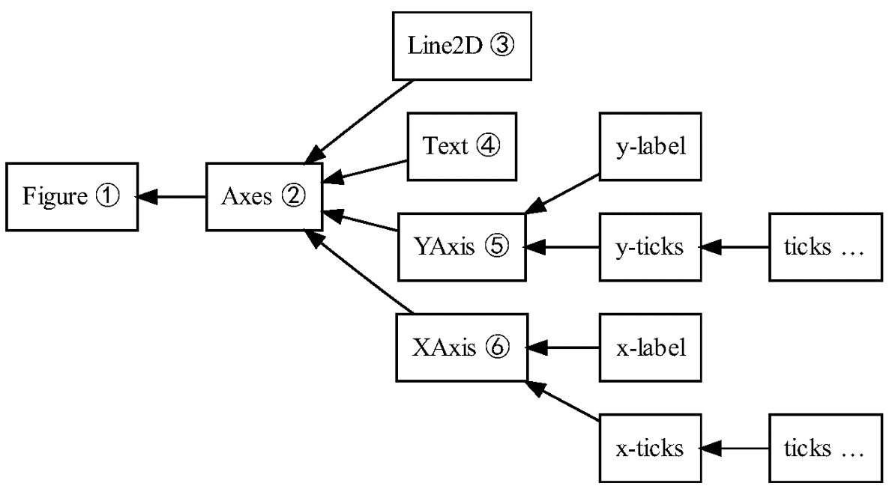
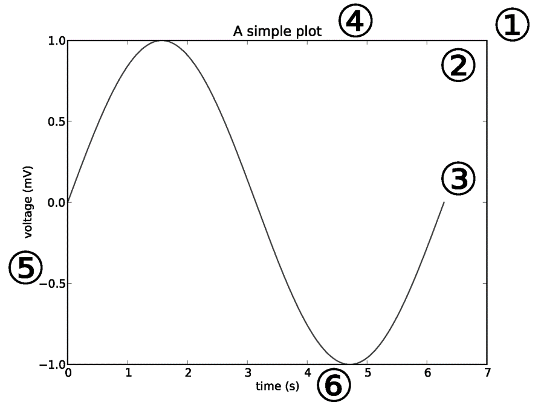
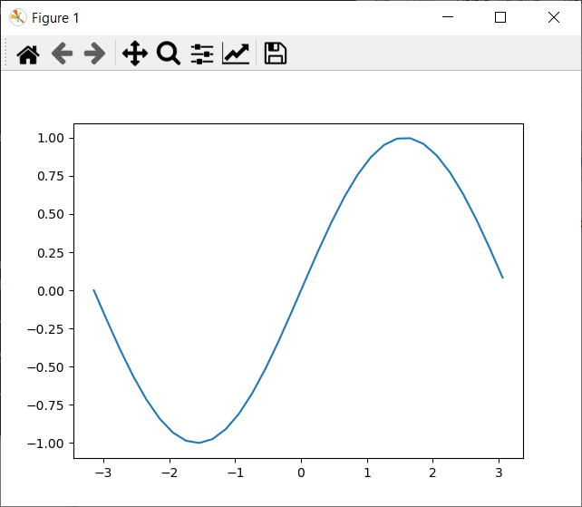
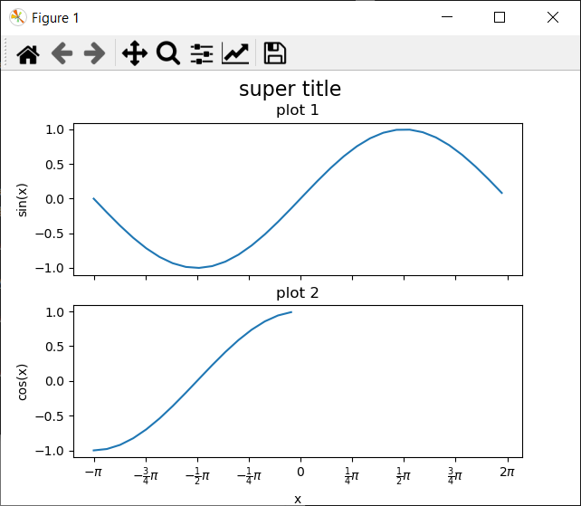
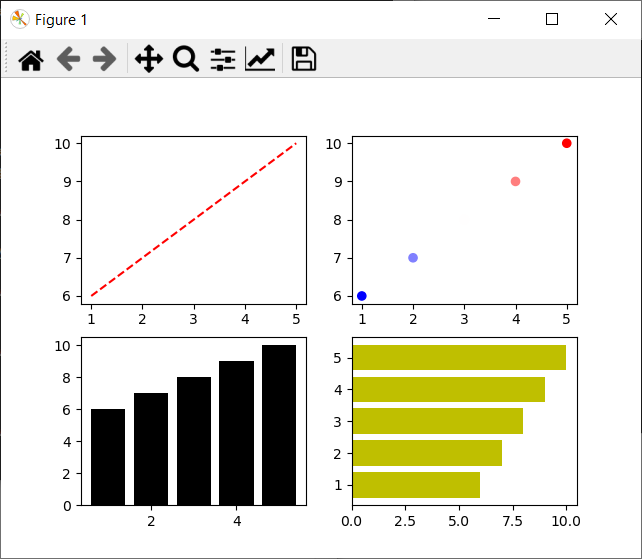

```{css, echo=FALSE}
@import url("https://netdna.bootstrapcdn.com/bootswatch/3.0.0/simplex/bootstrap.min.css");
.main-container {max-width: none;}
div.figcaption {display: none;}
pre {color: inherit; background-color: inherit;}
code[class^="sourceCode"]::before {
  content: attr(class);
  display: block;
  text-align: right;
  font-size: 70%;
}
code[class^="sourceCode r"]::before { content: "R Source";}
code[class^="sourceCode python"]::before { content: "Python Source"; }
code[class^="sourceCode bash"]::before { content: "Bash Source"; }
```

<font size="6">[WUR Geoscripting](https://geoscripting-wur.github.io/)</font> 

# Python Programing

In the previous tutorial, we learned how to set up virtual environments to write and run python code. In today's tutorial, we will start using these environments. Next week we will work with spatial data analysis which more often than not results in data being displayed on a map. 
During this tutorial, we will demonstrate different ways to visualize data on a map in both static and interactive formats. This can be done using several open source packages that built upon each other. To understand the functionality of these packages and how they can be integrated, we will refer to the concepts of Object Oriented Programming (OOP). Object Oriented Programming is a way of programming where objects are fundamental building blocks that supports code modularity and reusability. Since OOP is commonly used in the development of open source packages, we can reuse and adapt already developed code and its functionality. Therefore, before we go into the visualization part of this tutorial we will begin by explaining Object Oriented Programming. 


## Today’s Learning objectives

-   Familiarize yourself with python objects and inheritance
-   Learn to make basic vizualizations and static maps with Matplotlib
-   Use GeoPandas built in plot functionality to vizualize GeoPandasDataFrames
-   Create basic interactive maps

## TO DO! Create the yaml with dependencies 

```
name: python-programming
dependencies:
  - cartopy
  - python
  - spyder
  - geopandas
  - rasterio
  - 
```
# Python help

Before we dive into python, it makes sense to take some time to find how what to do if you are stuck. There are several ways to find help with programming in Python. Most packages, especially the larger ones, have a webpage with documentation. The documentation is a good first place to look for information. Secondly, googling your issue typically solves your problem too, because it finds answers on multiple platforms, such as StackOverflow and Github. Try to use terms that are used by others, don't include filepaths and personal variable names for example. Generative AI is also a useful source of coding help, but be careful, GenAI doesn't understand programming, it might come up with not existing functions for example. Lastly, during Geoscripting we have the forum to ask and give help. Asking your friends or colleagues in person is also a great way to learn and fix programming problems. Another good option is get documentation and more information about a package inside Python:

```{Python,engine.path='/usr/bin/python3', eval=FALSE}
import sys
help(sys)
```

See how the objects and functions in the `sys` package got listed.

```{block, type="alert alert-success"}
> **Question 1**: What kind of functionality does the `sys` package provide?
```


# Object-Oriented Programming in Python

Up until now in this course we have looked at R mainly as a scripting language. We call this way of programming Procedural Programming, where procedures (functions) are called in series of steps. Both Python and R can be used in another programming paradigm: Object Oriented Programming. Object Oriented Programming (OOP) is a way of programming where functionality and information is encapsulated in objects. Instead of assigning values and functions to variables individually, objects are used where both values (properties, attributes) and calculations (functions, methods) can be stored together. This offers several advantages. 
- OOP promotes modularity and re-usability by breaking down complex problems into smaller, manageable units - the objects. These objects can be reused in various parts of the program or even in other projects, leading to more efficient, scalable and organized programming. This is especially important when working on projects containing lots of code. OOP will make your work a lot easier to understand for you and others and it will make it easier to re-use parts of the code.

## How to work with objects in Python

In Python, objects are created and manipulated using classes. A class serves as a blueprint that defines the structure and behavior of an object. It brings together data (properties) and functions (methods) into a single object. To define a class in Python, we use the `class` keyword, followed by the name of the class. Let's take a look at an example of a simple class called `Person`:

```{python, eval=FALSE}
class Person:
    def __init__(self, name, age):
        self.name = name  # < this is a property
        self.age = age    # < this is also a property
    
    def greet(self):  # < This "function" is a method
        print(f"Hello, my name is {self.name} and I'm {self.age} years old.")
```

The `Person` class has two properties, `name` and `age`, as well as one method, `greet`. The `greet` method prints a greeting message that includes the person's name and age.

In the provided code, the `__init__` method is a special method known as a *constructor*. It is automatically called when an object (also known as instance of an class) is created from the class. The `self` parameter refers to the instance of the class itself, allowing access to its properties and methods that have been assigned during instance creation or when the class was defined Whenever a method is defined within a `class` (like `greet` method), we give `self` as the first parameter.

To create an instance of the `Person` class, you simply call the class as if it were a function and assign the result to a variable:

```{python, eval=FALSE}
person1 = Person("Alice", 25)
person2 = Person("Bob", 30)
```

We have created two objects, `person1` and `person2`, which are instances of the `Person` class. Now we can access the properties and call the methods of these objects:

```{python, eval=FALSE}
print(person1.name)  # Output: Alice
print(person2.age)   # Output: 30
person1.greet()      # Output: Hello, my name is Alice and I'm 25 years old.
person2.greet()      # Output: Hello, my name is Bob and I'm 30 years old.
```

This example is straightforward, but keep in mind that classes can become more complex.

```{block, type="alert alert-success"}
> **Question 1**: Take a look at the [implementation of a geoseries](https://github.com/geopandas/geopandas/blob/80edc868454d3fae943b734ed1719c2197806815/geopandas/geoseries.py#L79) object in GeoPandas. Don't be intimidated by the amount of code! It is not necessary to understand all of it. At line [948 the plot method is defined](https://github.com/geopandas/geopandas/blob/80edc868454d3fae943b734ed1719c2197806815/geopandas/geoseries.py#L948) it calls the [`plot_series` function as defined here](https://github.com/geopandas/geopandas/blob/80edc868454d3fae943b734ed1719c2197806815/geopandas/plotting.py#L313). What library is used for plotting and what exactly does `self` refer to when the `plot` method is defined?
```

## Inheritence

You may have noticed that class definitions differ very slightly from what we have learned. In the `GeoSeries` example, the class is defined as follows:

```{python, eval=FALSE}
class GeoSeries(GeoPandasBase, Series):
```

However, we previously learned to define a class like this:

```{python, eval=FALSE}
class GeoSeries:
```

The difference lies in the code within the parentheses, which represents *inheritance*. The class will inherit all the functionality from the classes specified as arguments, in this case, `GeoPandasBase` and `Series`. The `Series` object refers to the [Pandas.Series](https://github.com/pandas-dev/pandas/blob/main/pandas/core/series.py#L243C15-L243C15), which contains thousands of lines of code with various functionality. Therefore, the GeoPandas `GeoSeries` contains all the functionality implemented in Pandas, as well as those from `GeoPandasBase` and `GeoPandas.Series`itself. When new functionality is developed for the `Pandas` package, this is directly available in the `GeoPandas` objects, since we inherit all functionality from pandas.

Phew, that's a lot of complicated code, and it may seem overwhelming. You don't need to understand every detail. The important thing is to grasp the value of classes, objects, and inheritance. When creating a class, we can inherit functionality from another class. How does this work in a simple example?

So, we've learnt that with inheritance, classes can inherit all the functionality from other classes and build upon that. Let's create a new object called `Student`, which will inherit all the properties and methods from the `Person` class we defined earlier. In the end, a student is a person, and it possesses all its characteristics.

```{python, eval=FALSE}
class Student(Person):
    def __init__(self, name, age, student_id):
        super().__init__(name, age)
        self.student_id = student_id
        self.is_studying = False
    
    def study(self):
        self.is_studying = True
        print(f"{self.name} is studying.")
```

In the provided code, the `Student` class inherits from the `Person` class, which we will refer to as the superclass. By doing so, it extends the functionality of the superclass by adding a new property (`student_id`) and a new method (`study`). The `super()` function is used to call the superclass's `__init__` method (in this case from the `Pesron` class), allowing the subclass to initialize the inherited properties.

As a result, the `Student` class contains both the methods and properties inherited from the `Person` class, as well as the additional ones defined within the `Student` class:

```{python, eval=FALSE}
student = Student("Eve", 22, "123456")
print(student.name)         # Output: Eve
print(student.student_id)   # Output: 123456
student.greet()             # Output: Hello, my name is Eve and I'm 22 years old.
student.study()             # Output: Eve is studying.
```

In this example, `student` is an instance of the `Student` class. It can access the inherited properties from the `Person` class, such as `name`, as well as the newly added property `student_id` and `is_studying`, which defaults to `False`. Similarly, it can invoke both the inherited method `greet` and the additional method `study`, which are specific to the `Student` class. The method `study` prints a message and sets the `is_studying` property to `True`.

```{block, type="alert alert-success"}
> **Question 2**: Create a new class called `Teacher`. This new class also inherits from `Person`. Define a method for the teacher that checks whether a student is studying. The student should be an input to the method. 
```

# Visualization

Communicating research results is challenging without good visualizations like graphs or more elaborate infographics, and in the case of geospatial data analysis, a map. There are many tools to vizualize data using python, some of them can become very elaborate. 
The most basic and one of the most used tools is *Matplotlib*, a general plotting package. It is used as a base for many other, more tailored packages. One of the core advantages of Matplotlib is that the representation of the figure is separated from the act of rendering it. This enables building increasingly sophisticated features and logic into the figure, a bit like adding many layers to a map in a GIS. Matplotlib can be used to create simple graphs but also maps. Have a look at the [Python Graph Gallery](https://python-graph-gallery.com/matplotlib/) to see some examples, but don't look at the code yet! We will take you through it step by step.

## Matplotlib

In the most basic form plotting is very easy. Look at the code below:

```{Python,engine.path='/usr/bin/python3'}
import numpy as np
from matplotlib import pyplot as plt

# Create some data
x = np.arange(-np.pi, np.pi, 0.2)
y = np.sin(x)

# Plot x against y
plt.plot(x, y)

# Show the plot
plt.show()
```

In this example, we are using the package numpy to create a series of x values (values from -pi (-3.14) to pi with steps of 0.2, check what this looks like). The y values are the sine of these values. Plotting these values is straightforward. However, as said, Matplotlib is a plotting package where a vizualization object can be created before it is rendered (shown). In the example above, the rendering of the image is only done at the line `plt.show()`. Before this command, we can modify the plot. This allows to add things to the vizualization in steps, layering the complexity. To understand how this works, it is important to understand the hierarchy of the figure object. Have a look at the image below.

<figure>

 

<figcaption> Matplotlib hierarchy of figure elements, source <https://www.aosabook.org/en/matplotlib.html>.</figcaption>

</figure>

The basic elements are the *figure* and the *axes* objects (not to be confused with *Axis* objects!). The figure is like the canvas and the axes is the part of the canvas on which we will make a visualization containing for example an x-axis, y-axis, lines and text. Let's build up a simple line figure as an example.

</img>

Note that the behavior of `plt.show()` depends on how you run the script. If you are using Spyder and want `plt.show()` to work:

1.  Go to Tools.
2.  Go to Preferences.
3.  Select IPython console.
4.  Go to Graphics tab.
5.  In the Graphics backend section, select Automatic as the backend type.
6.  Restart your kernel (go to Console > Restart kernel).

Instead of a single plot, we can add different plots to the figure, for example two. Let's try to add another pot with the cosine values.

```{Python,engine.path='/usr/bin/python3'}
# Create some data
x = np.arange(-np.pi, np.pi, 0.2)
sine = np.sin(x)
cosine = np.cos(x)
```

We can use the subplots method to create a figure and an array of two axes, one for each plot. Check the [subplots documentation](https://matplotlib.org/stable/api/_as_gen/matplotlib.pyplot.subplots.html) to learn more. By using The `sharex` and/or `sharey` argument, we can share axis between different plots for easy comparison between the subplots. Let's initiate the figure and the two axes (don't confuse axis and axes! we are initiating 2 axes, one for each plot) and let the figure share the x-axis.

```{Python,engine.path='/usr/bin/python3'}
# Initiate a figure with two subplots 
f, axarr = plt.subplots(2, sharex=True)

```

```{block, type="alert alert-success"}
> **Question 2**: `axarr` is an array. What are the elements of this array and how many elements does is exist out of? 
```

We can add a title to the figure and and labels to the axes. Check [this documentation](https://matplotlib.org/stable/api/axes_api.html) to see what more you can tweak.

```{Python,engine.path='/usr/bin/python3'}
# Subplots are stored in an array
line = axarr[0].plot(x, sine)
axarr[0].set_title('sine plot')
axarr[1].plot(x, cosine)
axarr[1].set_title('cosine plot')
f.suptitle('This is an image of a two plots', fontsize=16)

```

We looked now at the axes, let's look at the axis as well. We can change the positions of the tick marks to something meaningful in the context of trigonometric functions and customize the labels with regular text or style it using lateX. Check if you understand what object in the hierarchy is edited and why.

```{Python,engine.path='/usr/bin/python3'}
# Axis label
axarr[1].set_xlabel('x')
axarr[0].set_ylabel('sin(x)')
axarr[1].set_ylabel('cos(x)')


new_ticks = np.arange(-np.pi, np.pi + 0.1, 0.25 * np.pi)
new_labels = [r"$-\pi$", r"$-\frac{3}{4}\pi$",
              r"$-\frac{1}{2}\pi$", r"$-\frac{1}{4}\pi$",
              "$0$", r"$\frac{1}{4}\pi$",
              r"$\frac{1}{2}\pi$", r"$\frac{3}{4}\pi$",
              r"$2\pi$"]
axarr[1].set_xticks(new_ticks)
axarr[1].set_xticklabels(new_labels)
```

Finally! our plot is done for now. We have entered a lot of commands, stacked a lot of different layers to our plot, but we cannot see it yet. using the `plt.show()` command we can see the result!

```{Python,engine.path='/usr/bin/python3'}
plt.show()
```

Alternatively we can use `plt.savefig('filename.png')` instead of showing it. Make sure to create the plot before you run this! `plt.show()` closes and the current plot, so calling savefig after show will result in an empty image. This is useful, otherwise we would keep adding stuff to the same plot.

</img>

One can create multiple subplots (axes) and use different plotting styles, changing e.g. the marker style, line style, marker size, and colors, see the example below. For the upper left subplot it is demonstrated how to add a legend; adding a label to the plotted line is essential for this.

```{Python,engine.path='/usr/bin/python3'}
from matplotlib import pyplot as plt

x = [1, 2, 3, 4, 5]
y = [6, 7, 8, 9, 10]

# New: define number of rows and columns of subplots and unpack them directly 
# into variables that then each contain one axes object
f, ((ax0, ax1), (ax2, ax3)) = plt.subplots(2, 2)

# Dashed line, label for legend, and show the legend on the subplot
ax0.plot(x, y, 'r--', label='red dashed line')
ax0.legend(loc='lower right')

# Scatter plot, using a colormap based on the y-value, changing the marker size to 35
ax1.scatter(x, y, c=y, cmap='bwr', s=35)

# Bar chart, changing the bar color to black
ax2.bar(x, y, color='k')

# Horizontal bar chart, changing the bar color to yellow
ax3.barh(x, y, color='y')
plt.show()
```

</img>

```{block, type="alert alert-success"}
> **Question 4**: In the upper right subplot, why is there no point at x=3, y=8?.
```
There are more types of graphs available, have look at the [Matplotlib documentation](https://matplotlib.org/stable/plot_types/index.html) and play around to find out more! 


## Vizualizing spatial data

So, plotting sine and cosines is fun and all, but this is a course about **geo**scripting, so how is this going to help you making maps? Well, Matplotlib really is fundamental when it comes to plotting things in python. Almost every package that can be used to create static plots (and even some dynamic ones) is based upon or uses Matplotlib, and lots of the logic you just saw will therefore be reused: the figures-, axes- and axis-objects are reused in many packages. As we saw, GeoPandas plot functionality is completely based upon Matplotlib.
We will show you how to create maps using `Cartopy`, a geospatial wrapper around Matplotlib. Have a look at the [definition of the `GeoAxes`](https://github.com/SciTools/cartopy/blob/main/lib/cartopy/mpl/geoaxes.py#L354). What does it inherit from? And what does this mean for its functionality? 

For working with vector data we will use among others `GeoPandas` and for raster data we will use `Rasterio` packages. A more elaborate introduction to these packages will follow in the respective tutorials covering raster and vector analysis. In this tutorial we will use these packages already for reading data, if you do not entirely understand why we do certain things related to these packages, most likely this will be cleared up next week.

For this tutorial, part of the material was taken from the [project pythia](https://foundations.projectpythia.org/core/cartopy/cartopy.html) website, an excellent source for more information and tutorials about working with python! 

## Cartopy
As said, Cartopy is basically adding the spatial component to Matplotlib. Therefore, a lot of the logic will be familiar. By adding spatial information (a coordinate reference system) to an Axes (turning it into a GeoAxes) we can reference our spatial data to each other. Additionally, cartopy has a built-in module to handle the referencing `cartopy.crs`. Let's import these libraries and modules. 

```{Python,engine.path='/usr/bin/python3', eval=FALSE}
import matplotlib.pyplot as plt
from cartopy import crs as ccrs
from cartopy import feature as cfeature
```

Let's start by creating a map of the world. We do this by generating 1 subplot (so just a plot) with the [Plate Carrée](https://en.wikipedia.org/wiki/Equirectangular_projection) projection, a projection where every point is spaced out equally in terms of degrees. 

```{Python,engine.path='/usr/bin/python3', eval=FALSE}
fig = plt.figure(figsize=(11, 8.5))
ax = plt.subplot(1, 1, 1, projection=ccrs.PlateCarree(central_longitude=-75))
ax.set_title("A Geo-referenced subplot, Plate Carree projection")
```

We don't see anything yet! That's because we have not put anything on the map. Let's add the coastline for some spatial context, which can be done by calling a method of the GeoAxes object `ax.coastlines`. 

```{Python,engine.path='/usr/bin/python3', eval=FALSE}
ax.coastlines()
```

coastlines is a special case, apparently showing the coastlines happened so often that a special function was defined. Not everything is this simple sadly... In the [cartopy documentation](https://scitools.org.uk/cartopy/docs/v0.14/matplotlib/feature_interface.html) we can see that there exist pre defined features that we can add using the `add_feature` method from a `GeoAxes`. `ax.add_feature(cfeature.COASTLINE, linewidth=0.3, edgecolor='black')` does the same as `ax.coastlines()` (don't believe it? [Check the source](https://github.com/SciTools/cartopy/blob/75939f9e81ac67838c52ce80230e4431badbeace/lib/cartopy/mpl/geoaxes.py#L609)! ) effectively. Have a look and play around with adding other features! Using the `linewidth` and`edgecolor` arguments we can style the map. 

```{block, type="alert alert-success"}
> **Question 1**: Create a worldwide map with 3 different features, each styled differently. Also add the stockimage to the map. Use [the documentation](https://scitools.org.uk/cartopy/docs/v0.14/matplotlib/geoaxes.html?highlight=stock#cartopy.mpl.geoaxes.GeoAxes.stock_img) to see how.
```

We have now step by step built up a map in a Pate Carree projection system. However, this projection has some major issues, have you seen [how big Greenland is](https://www.thetruesize.com)?! Let's quickly create another map in another projection. In the [documentation](https://scitools.org.uk/cartopy/docs/latest/reference/projections.html) we can find a large list of projections that can be used.

```{Python,engine.path='/usr/bin/python3', eval=FALSE}
fig = plt.figure(figsize=(11, 8.5))
projLae = ccrs.LambertAzimuthalEqualArea(central_longitude=0.0, central_latitude=0.0)
ax = plt.subplot(1, 1, 1, projection=projLae)
ax.set_title("Lambert Azimuthal Equal Area Projection")
ax.coastlines()
ax.add_feature(cfeature.BORDERS, linewidth=0.5, edgecolor='blue');
```

## Smaller maps
We have seen now how to make worldwide maps, let's now make a smaller map with our own data. The polygon data that is shown here is read by `GeoPandas`, directly from a url. The `add_geometries` method reads the geometries from a GeoDataFrame, but can also read geometries from Shapelt (more about this in in the Python Vector tutorial). The `set_extent` method is used to define an area of interest, basically it sets the top bottom and left and right so that only the area of iterest is shown. Have a look at the code below, the comments explain more line by line.

```{Python,engine.path='/usr/bin/python3', eval=FALSE}
import geopandas as gpd

gdf = gpd.read_file('https://raw.githubusercontent.com/GeoScripting-WUR/PythonProgramming/master/data/gadm41_NLD_2.json')

# Using the dutch coodinate reference system RDNew (epsg code 28992)
crs = ccrs.epsg(28992)

# The data is in another projection as our plot, reprojection to RDnew
gdf = gdf.to_crs(28992)

# Initiate the plot, a little bigger then before
fig = plt.figure(figsize=(15, 15))
ax = plt.subplot(1, 1, 1, projection=crs)
ax.set_title('The municipalities of NL')

# Draw gridlines 
gl = ax.gridlines(
    draw_labels=True, linewidth=2, color='gray', alpha=0.5, linestyle='--'
)

# Set the extent to the extent of the municipalities
min_x, max_x, min_y, max_y = gdf.total_bounds
ax.set_extent((min_x, max_x, min_y, max_y), crs=crs)

# ax.set_extent(gdf.total_bounds, crs=crs) would do this in one step, 
# but the coordinates can be defined seperately as well in this order! 

# Add the geometries to the map
ax.add_geometries(gdf["geometry"], crs=crs, edgecolor = 'black', facecolor = '#FFFFFF')
```

## Plotting rasters
In the case of rasters, we will make use in another way of the widespread use of `Matplotlib` and the `GeoAxes` objects. For rasters we will make use of the package `Rasterio` to handle raster files. In this package a [plot module](https://github.com/rasterio/rasterio/blob/7c83de410b7b812e6552e4b76ce236bb6213c80d/rasterio/plot.py#L34) is defined, that allows for the plotting of rasters. Instead of defining an axes and adding the raster as a feature to the plot, we will create the `Figure` and `GeoAxes` objects using `Cartopy`, and pass them to `Rasterio` `plot.show` function. Other features that we might want to add, we can add still to the same `GeoAxes`, in that way everything will be added to the same canvas. Have a look at the code below. 

```{Python,engine.path='/usr/bin/python3', eval=FALSE}
import requests
import io 
import zipfile 
import rasterio
from rasterio.plot import show

# These first 4 lines download and unzip a landsat8 image 
# It is not necessary to understand these lines. 
url = 'https://github.com/GeoScripting-WUR/VectorRaster/releases/download/tutorial-data/landsat8.zip'
resp = requests.get(url, "data.zip")
zf = zipfile.ZipFile(io.BytesIO(resp.content))
zf.extractall('./')

#The landsat image is projected in UTM31N, let's use that projection
crs = ccrs.epsg(32631)

# Initiate the area of interest
fig = plt.figure(figsize=(15, 15))
ax = plt.subplot(1, 1, 1, projection=crs)
ax.set_title('The municipalities of NL')

# Read the GeoJson again with GeoPandas.
gdf = gpd.read_file('https://raw.githubusercontent.com/GeoScripting-WUR/PythonProgramming/master/data/gadm41_NLD_2.json')
# This time reproject it to UTM31
gdf = gdf.to_crs(32631)
gdf.plot(ax=ax,edgecolor='white', color = 'None')

# Open the raster using rasterio, more about rasterio next week! 
dataset = rasterio.open('./LC81970242014109LGN00.tif')
show(dataset, ax=ax,  cmap='gist_ncar')
```


# What have we learned?

#TODO

# More info

-   [Official Python tutorial](https://docs.Python.org/3/contents.html)
-   [Python Style guide](https://www.python.org/dev/peps/pep-0008/)
-   [Python 3 Cheatsheet](https://ugoproto.github.io/ugo_py_doc/py_cs/)
-   [Overview Python package Cheatsheets](https://www.datacamp.com/community/data-science-cheatsheets?tag=python)
