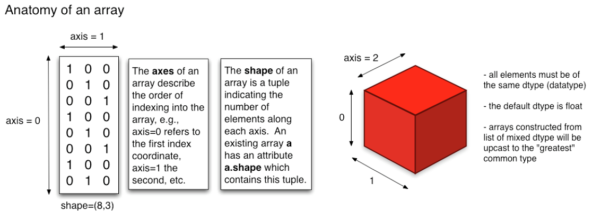
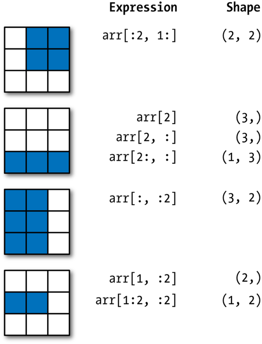
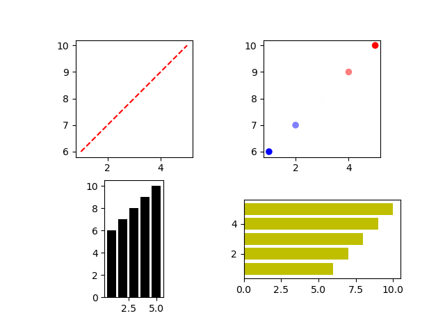

<style type="text/css">
body {max-width: none;}
a:visited {color: #91170a;}
</style>

# [WUR Geoscripting](https://geoscripting-wur.github.io/) 

# Week 3, Tutorial 8: Python refresher

## Introduction

Good morning! Today we will start working with Python for geoscripting and do a refresher of functions in Python. If you are unfamiliar with Python and/or feel that you need more training, follow one of the Datacamp courses as introduction into Python *before today*:

* [Introduction to Python](https://www.datacamp.com/courses/intro-to-python-for-data-science) | recommended to follow if you haven't any scripting experience so far
* [Python for R users](https://www.datacamp.com/courses/python-for-r-users) | recommended if you have experience already in R

## Today’s Learning objectives

- Know how to work with virtual environments: Conda + Mamba
- Know how to run a Python script from the terminal
- Get introduced to Python editors and IDEs
- Refresh Python programming knowledge


# Introduction to Python

Python is a jack-of-all-trades programming language that is free, flexible, open-source, cross-platform and has a very large community behind it. If you ask Python programmers what they like most about Python, they will often cite its high readability and high availability of good packages. There are many Python packages out there for geoscripting, data wrangling, visualization and machine learning. For example:

* Geoscripting
    * GeoPandas (Vector Processing)
    * Rasterio (Raster Processing)
    * GDAL/OGR (Vector and Raster Processing)
    * QGIS plugins (Open Source GIS)
    * ArcPy (Propietary GIS)
* Data Handling
    * Pandas (Dataframes and Data Analysis)
    * NumPy (Scientific Computing)
* Visualization
    * Matplotlib (General Graphics)
    * Seaborn (Statistical Graphics)
    * Folium (Interactive Maps)
* Machine Learning
    * scikit-learn (Machine Learning)
    * Keras + TensorFlow (Deep Learning)
    * PyTorch (Deep Learning)

## Python package management with Conda
A set of tools co-exist for installing and managing Python packages. It is possible to install packages on your base Python interpreter, but sooner or later you will get conflicting Python packages since packages have varying dependencies. It can even [break your system Python interpreter](https://askubuntu.com/questions/95037/what-is-the-best-way-to-install-python-packages).

Instead, we recommend to create a `conda` environment on your local machine for each project. In `conda` environments, basically anything, such as software, C libraries or R packages can be installed. Here we use them here for installing Python packages. Packages installed in one environment do not interfere with your base Python or with other `conda` environments.

## Conda/Mamba installation
For this course, we will make use of Mamba, fast drop-in reimplementation of the Conda package manager. It has its core parts implemented in C++ for maximum efficiency, makes use of parallel downloading of repository data and package files using multi-threading, and uses `libsolv` for (much) faster dependency solving. 

Mamba replaces Conda for most commands, *except for activating and deactivating environments*. You will see more clearly how this works in practice in the first part of this tutorial.

To install Mamba in your Linux environment, we have prepared a short `Bash` script for you. Just run the following lines of code, line by line, in a new terminal window.

```{bash, eval=FALSE}
git clone https://github.com/GeoScripting-WUR/InstallLinuxScript.git
cd InstallLinuxScript/user
chmod u+x ./install.sh
./install.sh
```

<!-- This should be kept for external students, TODO: think about how to combine this
```{r, eval=FALSE, engine='bash'}
MINICONDA_VERSION="Miniconda3-latest-Linux-x86_64"
pushd /tmp
curl -O https://repo.continuum.io/miniconda/${MINICONDA_VERSION}.sh
## This installation script will require user input
bash ${MINICONDA_VERSION}.sh
rm ${MINICONDA_VERSION}.sh
popd
```

<<<<<<< HEAD
Scroll down the license with enter. Accept License (i.e. type yes). Use default install location (i.e. press Enter). When prompted to prepend the Conda install location to path agree (i.e. type yes). This makes the Python interpreter of Conda the standard Python interpreter and allows you to run Conda commands from command line. *Finally, <u>restart your terminal</u> to be able to use conda in the terminal*. 
=======

Scroll down the license with enter. Accept License (i.e. type yes). Use default install location (i.e. press Enter). When prompted to prepend the Conda install location to path agree (i.e. type yes). This makes the Python interpreter of Conda the standard Python interpreter and allows you to run Conda commands from command line. -->

This will install Mamba into `~/mamba`. Finally, restart your terminal to be able to use `mamba` and `conda` in the terminal. Next, let's see how to use Mamba in case you want make new virtual environments by yourself, or install packages after creating the environment.

## Mamba usage
Mamba creates isolated `conda` environments with sets of packages, that do not interfere with your base Python or with other `conda` environments. To create an environment:

```{r, eval=FALSE, engine='bash'}
mamba create --name geotest python numpy
```

This would create a new environment called `geotest` with Python 2.7 and `NumPy` and `Spyder` installed into the `conda` environment. Another option is to create an environment from a `.yaml` file, in which all required modules are listed. You will see an example of this later on in this tutorial. To create an environment from such a file, you can use the argument `--file` (or `--f` in short). 

Let's first list the currently available environments:

```{r, eval=FALSE, engine='bash'}
mamba info --envs
```

Mamba puts an asterisk (*) in front of the active environment. To activate the environment:

```{r, eval=FALSE, engine='bash'}
# Cross-platform (but not always working)
conda activate geotest

# Linux, macOS
source activate geotest

# Windows
activate geotest
```

After this, the current environment is shown in parentheses in front of your prompt (`(geotest)$`). Note that the activated environment is only valid for the shell in which you activated it. For instance, if you close the shell window and open a new one you will have to activate it again.

After creating a `conda` environment, (additional) Python packages can be installed. There are three possible ways to install packages, which we list below. In the documentation of most Python packages the recommended way to install them can be found.

* Using `mamba` to install and manage `conda` packages. This downloads `conda` packages using `conda` channels, which are URLs to directories containing the `conda` packages. **Generally, installing `conda` packages using `mamba` is the preferred method.**
* Using `pip` to install packages and `mamba` to manage these packages. `pip` is available for Windows, macOS and Linux. `pip` can also install [binary wheels on Windows](https://www.lfd.uci.edu/~gohlke/Pythonlibs).
* Using the distribution's package manager (only on Ubuntu, that is `sudo apt-get install python-*`).

The `mamba search` command searches a set of channels. By default, packages are automatically downloaded and updated from the default channel. To search for a package, type:

```{r, eval=FALSE, engine='bash'}
mamba search pandas
```

This gives a list of all packages that have "pandas" in the name and lists all available versions. To install:

```{r, eval=FALSE, engine='bash'}
mamba install pandas
```

This installs the latest compatible version of _Pandas_. Note that this would install it into your currently activated environment.

Note that you can also install multiple packages at the same time: 

```{r, eval=FALSE, engine='bash'}
mamba install geopandas matplotlib
```

As you saw with _Spyder_ (which is an IDE, more on that later), `mamba` is also able to install some non-Python packages that have Python bindings. This is useful for making sure your Python and binary versions match and do not interfere with the system-wide ones.

Some additional helpful utilities for package management in this context are:

* `mamba list` to check which packages are installed in `root` or in the active environment;
* `python --version` or `gdal-config --version` to check which Python or GDAL version is used in the environment;
* `which spyder` or `type spyder` to find out which _Spyder_ executable is used either from system or `conda` environment.

Removing packages is just as simple:

```{r, eval=FALSE, engine='bash'}
mamba remove geopandas pandas folium
```

Now, we deactivate the environment and return to base environment.

```{r, eval=FALSE, engine='bash'}
# Cross-platform
conda deactivate

# Linux, macOS
source deactivate

# Windows
deactivate
```

When we are finished, and do not need the environment for next time, we can remove the environment `geotest`.

```{r, eval=FALSE, engine='bash'}
mamba remove --name geotest --all
```


## Running a Python script in the terminal

Within a `conda` environment, Python can be started directly, or can be called to run a script file. To start Python directly:

```{r, eval=FALSE, engine='bash'}
python
```

Now, you can type Python expressions that will be executed one by one:

```{Python,eval=FALSE, engine.path='/usr/bin/python3'}
import sys
print('Good morning, you are running Python:', sys.version)
```

To go back, type:
```{Python,engine.path='/usr/bin/python3', eval=FALSE}
exit()
# or 
quit()
```

Usually, we do not want to run expressions one by one, but build scripts instead, to ensure transferability and reproducibilty. Create a new text file and (re)name it (to) `test.py`. Open it, for example with a text editor, paste in the code you used above (`import sys` etc.), and save the script. Navigate in the terminal to the location where this script is stored, using `cd`. Finally, run the script with:

```{r, eval=FALSE, engine='bash'}
python test.py
```

The output is printed to the terminal. Running a script from the terminal is less error-prone than running it from an IDE (see the next section), such as Spyder, as IDEs often keep variables in memory after the script has finished running. Therefore, running a script from the terminal is a good final test before submitting an exercise or assignment. 

## Python editors and IDEs
There is a number of Integrated Development Environments [IDE] for Python. An IDE is a software application that provides facilities for software development.

* [Jupyter Notebook](http://jupyter.org/) integrates visualization with code and is suitable to make tutorials, simple dashboards, quick visualizations, and do prototype testing. Jupyter Notebooks run in your browser on a localhost server or on a web server. They allow for various programming languages, e.g. Python, R, Julia, Spark or PySpark. 
* [Spyder](https://www.spyder-ide.org/) is a lightweight IDE. *In this course, Spyder is the recommended Python IDE.*
* [PyCharm Community Edition](https://www.jetbrains.com/help/pycharm/install-and-set-up-pycharm.html) is a free professional Python IDE with a lot of advanced functionality, such as integrated GIT version control, code completion, code checking, debugging and navigation. This IDE can optionally be used by more advanced scripters during this course instead of Spyder, but do know that you will not be assisted for solving IDE-related issues.

### Jupyter Notebooks

Jupyter Notebooks integrate code and visualization, and are therefore helpful for demonstration purposes. Install `jupyter` and the module `folium` in an existing or new environment that includes Python and start Jupyter:

```{r, eval=FALSE, engine='bash'}
jupyter notebook
```

Jupyter should pop up in your browser. You will see a menu with all files in your working directory. The Jupyter Notebook will only see files that are accessible from the working directory in which you launched the notebook!

Make a new folder: *New* → *Folder*, rename the folder (check the box next to the new 'Untitled Folder' and click **'Rename'** in the top) and, in this folder, create a new Python3 Jupyter Notebook *New* → *Python 3*. Give your notebook a name by clicking on *untitled*. Note that this creates a file with the extension *.ipynb*, which stands for Jupyter Notebook. 

Feel free to have a go at the user interface tour (*Help* → *User Interface Tour*), or hover over the toolbar to check out the tools. The main tools are:

- _Save and checkpoint_
- _Insert cell below_
- _Run_
- _Code/Markdown/Heading_ (List box)

Similar to RMarkdown, Jupyter Notebooks have code cells (*Code*) and text cells (*Markdown*). Insert two extra cells by clicking the + button and change the first cell from code to markdown. Enter some documentation for your code (e.g. your team name, exercise and date). Leave the other cell on code. 

Type the following Python code in the code cell:

```{Python,engine.path='/usr/bin/python3', eval=FALSE}
import folium
m = folium.Map(location=[51.9700000, 5.6666700], zoom_start=13)
m
```

Run the code cell by selecting it and pressing the *Run* button, or press *CTRL + Enter* or *Shift + Enter*. You'll see a map visualized below your code, similar to the one below. Try to drag the map to play around with it. 

</img>

Your Jupyter Notebook is automatically saved as an `.ipynb` file on your computer (the file extension comes from the historic name "IPython Notebook"). The notebook can be downloaded as a Python script, pdf or html. You can also save it manually. 

To exit a notebook properly, use *File* → *Close and Halt*. After that, by pressing Ctrl + c in the terminal where Jupyter Notebook server is running, you cancel the running process. The terminal goes back to command line and you can exit the virtual environment by typing `conda deactivate`.

```{r, engine='bash', eval=FALSE}
conda deactivate
```

### Spyder

The [Spyder IDE](https://docs.spyder-ide.org/) can be started in a terminal when the `spyder` package is installed in the active `conda` environment. So, using `mamba`, make an environment and install Spyder to that environment. Activate the environment using `conda`. Spyder will automatically make use of the Python interpreter of the active `conda` environment. To start Spyder:

```{r, eval=FALSE,engine='bash'}
spyder
```

In Spyder you should see an editor, a file explorer and a console. Have a look at the toolbar. Some important shortcuts are:

* F5 to run your script
* CTRL + S to save your script
* CTRL + 1 to comment/uncomment your code
* TAB to indent your code
* SHIFT + TAB to unindent your code

Open a new file and save it somewhere as `main.py` (File -- > New File --> Save As). Test writing a few lines of code and running the script.

# Python programming refresher

In the second part of this tutorial we will do a quick Python refresher. Again, we advise you to code in Spyder, as this IDE will be used in the rest of the Python week too.

First, make a folder structure for this tutorial:

```{r, eval=FALSE,engine='bash'}
cd ~/Documents/
mkdir PythonRefresher #or give the directory a name to your liking
cd ./PythonRefresher
mkdir output
```

We only make a directory for output, because no input data or separate scripts are created in this tutorial. Next, we will create a `conda` environment from a file. First create a text file in your preferred text editor, e.g. `gedit`. Then, (re)name it (to) `refresher.yaml`, and copy the following content into the file:

```
name: refresher
dependencies:
  - python
  - numpy
  - matplotlib
  - spyder
```

Now, create a new `conda` environment based on this file:

```{r, eval=FALSE, engine='bash'}
mamba env create --file refresher.yaml
```

Once everything is installed, activate the environment and start Spyder:

```{r, eval=FALSE, engine='bash'}
source activate refresher
spyder
```

Create a new Python script and save it. 

Important to note: for compatibility, it is best to install packages from the same channel as much as possible. Given that packages in the file `refresher.yaml` are installed from the `conda-forge` channel, it is wise to use this same channel when you want to install additional packages in your environment. 

## Classes and objects

Python is an *object-oriented programming language*. That is a programming paradigm that structures a code hierarchically with *classes* and *objects*. A class is a blueprint of functions and attributes to build an object, while an object is a self-contained component operationalizing the functions and attributes.

For example, one could have a class `dog` with functions, `bark()` and `doginfo()`, and properties `breed` and `age`. 

```{Python,engine.path='/usr/bin/python3', eval=FALSE}
class Dog:
    def __init__(self, breed, age):  
        self.breed = breed
        self.age = age

    def bark(self):
        print("bark bark!")

    def doginfo(self):
        print("This " + self.breed + " is " + str(self.age) + " year(s) old.")
```

One can then create an *instance* of this class, i.e. an object, that represents Ozzy, a Maltese of two years old. This object can apply the function `eat()` and `run()`. We can call the attributes and functions with the dot notation:

```{Python,engine.path='/usr/bin/python3', eval=FALSE}
ozzy = Dog("Maltese", 2)
print(ozzy.breed)
print(ozzy.age)
ozzy.bark()
ozzy.doginfo()
```

During Geo-scripting, you do not need to define your own classes. However, sometimes existing classes of modules will be used, such as a `DataFrame` in Pandas or a `GeoDataFrame` in GeoPandas. It is therefore important to understand the concepts of classes and objects generated from them.

```{block, type="alert alert-success"}
> **Question 1**: Suppose that we want to build a script in Python of an orchestra playing a song. What would be the class and what would be the objects?
```

## Data types and variables

Values belong to a data type. The most important built-in (base) types are:
* integer
* floating point
* Boolean
* several compound data types (see next section), like string

Python is a strongly typed language. That is, you cannot perform operations inappropriate to the type of the value. For example, attempting to add integers to strings will fail. For this reason, understanding and being aware of value types in Python is crucial.

Values can be cast to other types, e.g.:

```{Python,engine.path='/usr/bin/python3'}
print(int(10.6))
```

```{block, type="alert alert-success"}
> **Question 2**: What is the difference between 10 and 10.0 in Python?
```

Often, we do not use values directly in a script. Instead, we use access them through variables. A variable is a way to reference to a known or unknown value. In Python, a value is assigned to a variable with the `=`-sign, e.g.:

```{Python,engine.path='/usr/bin/python3'}
building = 'Gaia'
buildingnumber = 101
print(building + ' is in Wageningen')
```

As opposed to other programming languages, in Python, the data type does not need to be explicitly defined when creating a variable. Python derives the data type of the variable from the value assigned to it. In the code above, the variable `building` is thus a string, and the variable `buildingnumber` is an integer, without having defined this explicitly.

Variable names should: 1) start with a lowercase letter, and 2) not contain spaces. Furthermore, it is advisable to use meaningful variable names, both for yourself and for (future) users of your code.


## Compound data types

*Compound data types* or container types are Python data types that have in common that they can be broken down into smaller *elements*. The most commonly known compound data types are:
- string
- list
- dictionary
- tuple
- NumPy array

For most compound data types, the elements can be accessed by providing the index of the element with the square-bracket operator, `[ ]`. This works, for example, for items in lists and letters in strings. Notice that indexing in Python, as opposed to other languages like R, **STARTS AT 0!** Positive indexes access elements from the front, and negative indexes from the back. Multiple elements can be selected with a colon `from:to`, where the first is inclusive and the last exclusive. Here is an example for accessing items in a list, and in a string:

```{Python,engine.path='/usr/bin/python3'}
# List
campus = ['Gaia', 'Lumen', 'Radix', 'Forum']
print(campus[3]) # Forum
print(campus[-1]) # the last item of the list
print(campus[0:3]) # the first 3 items (index 0, 1, and 2), i.e. 'slicing' 
our_building = campus[0] # GAIA

# String
print(our_building[0]) # G
print(our_building[0:2]) # GA
```

```{block, type="alert alert-success"}
> **Question 3:** What building is `campus[-2]`? Test it.
```

Lists can be nested. That means that a list is an item in another list. Accessing items in nested lists works the same as in regular lists, e.g,:

```{Python,engine.path='/usr/bin/python3'}
# Nested list
samples = [["x", "y", "z"], [12, 32, 7], [12, 40, 7]]

# Access the x
header = samples[0]
first_item = header[0]

# Or at once
first_item = samples[0][0]
```


```{block, type="alert alert-success"}
> **Question 4:** How can we access the value 40 above? Test it.
```

A *dictionary* is set of key-value pairs. The key can be used to access the value. A dictionary is different from the other compound data types as it is not ordered, i.e. the order of the elements is undetermined. As such, the square-bracket operator, `[ ]` cannot be used. 

```{Python,engine.path='/usr/bin/python3'}
# Dictionary
campus_dictionary = {101:'Gaia',
                     100:'Lumen',
                     107:'Radix',
                     102:'Forum',
                     104:'Atlas'}

# Access dictionary value using key
print(campus_dictionary[102])
```

In contrast to a list, a *NumPy array* is a *homogeneous multidimensional array* from the NumPy package. Homogeneous refers to the fact that all data in one array have to be of the same type. NumPy’s array class is called `ndarray` (n-dimensional). In the array, the dimensions are called *axes*, and the number of axes is the *rank*.

<figure>

<figcaption>Anatomy of a NumPy array, source https://valecs.gitlab.io/resources/numpy.pdf.</figcaption>
</figure>

Below, we show how to create a NumPy array from a set of lists. We also show how to create *standard* arrays, filled with zeroes, ones, or random number, often to be updated with actual data later in your script.

```{Python,engine.path='/usr/bin/python3'}
import numpy as np

# Create array from list
a = np.array([[1, 3, 4], [2, 7, 6]])
print('a is', a)

# Create standard arrays.
print(np.zeros((3, 2)))
print(np.ones((2, 3), int))
print(np.ones((2, 3), int) * 5)
print(np.empty((2, 2)))
```

Just like with other compound data types, the elements can be accessed with the square-bracket operator, `[ ]`. But in NumPy arrays, there is one index per dimension (per axis), separated by commas. Multiple elements per dimension can be selected with a colon (`from:to`, just like in a list). Leaving out the index before or after the colon, selects all elements from the beginning or to the end, respectively, see the examples in the figure below.

</img>

Finally, *structured NumPy arrays* can have a different data type per column, i.e. per attribute. It is thereby similar to a `DataFrame` in R (we'll look at another similar data type tomorrow). In structured NumPy arrays, you can access or edit attribute values either by dimension or by attribute name.

```{Python,engine.path='/usr/bin/python3'}
# Create create structured NumPy array filled with zeroes
data = np.zeros(4, dtype={'names':('name', 'age', 'weight'),
                          'formats':('U10', 'i4', 'f8')})
print(data.dtype)

# Now we can fill this structured array with data (lists) of the correct type
name = ['Alice', 'Bob', 'Cathy', 'Doug']
age = [25, 45, 37, 19]
weight = [55.0, 85.5, 68.0, 61.5]
data['name'] = name
data['age'] = age
data['weight'] = weight

# Inspect the result
print(data)
```

## Functions

A function is a section of code with a common purpose. Functions can be useful for 1) making the main part of the code concise, 2) debugging, as functions can be tested and edited separately from the main code, and 3) reuse of code in the same or other programs. 

Functions may (not always) accept *argument(s)*, perform an *action*, and may (not always) *return value(s)*. For example, the built-in function 'int()' we have seen before performs the action of converting a value to integer type:

```{Python,engine.path='/usr/bin/python3'}
# Return value into a variable, the function name, its (single) argument
myint = int(10.6)
```

You can also create functions yourself. The syntax for creating a function is:

```
def functionname(arg1, arg2, argn):
    ... (expression1) ...
    ... (expression2) ...
    ... (expressionn) ...
    return returnvar1, returnvar2, returnvarn

```

For example, we could create a function to compute the area of a rectangle based on its width and length, provided as arguments, and return the output: 

```{Python,engine.path='/usr/bin/python3'}
def calculate_rectangle_area(width, length):
    rectangle_area = width * length
    return rectangle_area

print(calculate_rectangle_area(4, 3))

# Or alternatively;
output_number = calculate_rectangle_area(width=4, length=3)
print(output_number)
```

Functions or classes can be made more informative by *docstrings*:

```{Python,engine.path='/usr/bin/python3'}
def calculate_rectangle_area(width, length):
    """Computes the area of a rectangle by multiplying width and length.

    :width: width is the width of the rectangle
    :length: length is the length of the rectangle
    :returns: width * length
    """
    rectangle_area = width * length
    return rectangle_area

print(calculate_rectangle_area(4, 3))
```

Variables created in functions are *local*. That means that a variable created in a function does not exist outside of the function. So, here, `rectangle_area` cannot be accessed outside of the function definition (after the indented part of the code). 

```{block, type="alert alert-success"}
> **Question 5**: Test typing `print(rectangle_area)` at the end of the code block defined above. What happens? Why is that?
```

## Modules and packages

Python packages and modules are collections of classes and functions. Any Python file is a _module_, its name being the file's base name without the `.py` extension. A _package_ is a directory of Python modules containing an additional `__init__.py` file, to distinguish a package from a directory that just happens to contain a bunch of Python scripts. Packages can be nested to any depth, provided that the corresponding directories contain their own `__init__.py` file.

Basically there are four ways to load a module and/or a package:
```{Python,engine.path='/usr/bin/python3', eval=FALSE}
import math
print(math.pi)

from math import pi
print(pi)

from math import pi as ip
print(ip) 

import numpy as np
print(np.pi)
```

```{block, type="alert alert-success"}
> **Question 6**: What are the differences between these four ways to import modules and/or packages?
```

Often-used internal packages/modules:

- `os`: Operating system features
- `sys`: System specific configuration
- `math`: Mathametical functions, operators and constants
- `datetime`: Date/Time functionality

## Conditionals

*Comparison operators* compare two values or, more commonly, variables. The operands (x and y below) are often numerical, e.g. floating point or integer. The result of comparison operators is a 0 (False) or 1 (True), of type Boolean.

```{Python,engine.path='/usr/bin/python3', eval=FALSE}
x == y    # TRUE if x is equal to y
x != y    # TRUE if x is not equal to y
x > y     # TRUE if x is greater than y
x < y     # TRUE if x is less than y
x >= y    # TRUE if x is greater than or equal to y
x <= y    # TRUE if x is less than or equal to y
```

*Logical operators* evaluate the logical relation between two values or variables. The operands (x and y below) are in most cases Boolean. The result of logical operators is also Boolean.

```{Python,engine.path='/usr/bin/python3', eval=FALSE}
x and y   # TRUE if both x and y are TRUE
x or y    # TRUE if x or y are TRUE
not x     # TRUE if x is FALSE
```

A *conditional statement* checks whether a condition is fulfilled and only if it does, it executes a block of code. The syntax of a conditional statement is:


```
if condition:
    ... (expression1) ...
    ... (expression2) ...
    ... (expressionn) ...
else:
    ... (alternative_expression1) ...
    ... (alternative_expression2) ...
    ... (alternative_expression3) ...

```

The condition should be a Boolean variable, or an expression resulting in a Boolean. A condition is typically built up using comparison operators and/or logical operators. The expressions after the `if`-statement are executed when the condition is met, while the conditions in the `else`-statement (not mandatory to include) are executed when the condition is not met. Multiple conditions can be checked consecutively with one or more `elif`-statements in-between the `if` and `else`. For example:

```{Python,engine.path='/usr/bin/python3'}
x = 3
if x == 1:
    print("it is one")
elif x == 2:
    print("it is two")
elif x == 3:
    print("it is three")
else: 
    print("above 3")
```


```{block, type="alert alert-success"}
> **Question 8**: Think of a conditional statement that uses logical operators in the condition instead of comparison operators.

```

## Loops

Loops are an essential construct in Python, more than in R. Two types of loops exist:
- the `for`-loop, used when it can be known beforehand how many iterations are required
- the `while`-loop, used when it cannot be known beforehand how many iterations are required

The `for`-loop is often the preferred construct, as it is computationally more efficient and less error-prone than the `while`-loop; no chance to end up in an endless loop or to accidentally skip an element (iteration). The syntax of a `for`-loop is:


```
for element in compound:
    ... (expression1) ...
    ... (expression2) ...
    ... (expressionn) ...

```

Often `i`, standing for iterator, is used as the `element`, but it can be any variable name. Key is that the current element is put into that variable in each iteration, so the `element` is what one should use in the expressions in the `for`-loop. The `for`-loop works on any compound data type:

```{Python,engine.path='/usr/bin/python3'}
# Looping a list
campus = ['Gaia', 'Lumen', 'Radix', 'Forum']
for i in campus:
    print(i)

# Looping
our_building = campus[0] # GAIA
for letter in our_building:
    print(letter)

```

The `while`-loop works on a condition instead of on a compound data type. The syntax of a `while`-loop is:


```
while condition:
    ... (expression1) ...
    ... (expression2) ...
    ... (expressionn) ...

```

In a `while`-loop, when an element is used, it is not automatically altered in each iteration; the alteration needs to be explicitly programmed. 

```{Python,engine.path='/usr/bin/python3'}
n = 0
while n < 20:
    print(n)
    n = n + 1
```


```{block, type="alert alert-success"}
> **Question 9**: What is the last number printed? Now print n after the loop (not in the indented part); what does it print?
```

You may remember that variables in a function are local. This is different for loops: Variables in a loop are NOT local, and thus affect what happens outside of the loop, as demonstrated by the last question. Be aware of this.

## Visualization 

Visualization is essential to make concepts understandable and patterns recognizable. In Python, _Matplotlib_ is a general plotting package. It is used as a base for many other, more tailored, packages. One of the core advantages of Matplotlib is that the representation of figure is separated from the act of rendering it. This enables building increasingly sophisticated features and logic into the figure, a bit like making a map in a GIS.

In Matplotlib, a *figure* object contains *axes*, or subplots. These axes contain an x-axis, a y-axis and can contain lines and text. This hierarchy is important to understand when you want to edit a plot:

<figure>

<figcaption>Matplotlib hierarchy of figure elements, source https://www.aosabook.org/en/matplotlib.html.</figcaption>
</figure>

<figure>

<figcaption>Elements in an example Matplotlib figure, source https://www.aosabook.org/en/matplotlib.html.</figcaption>
</figure>

Let's create a simple line figure, based on data in NumPy arrays.

```{Python,engine.path='/usr/bin/python3'}
import numpy as np
from matplotlib import pyplot as plt

# Create some data
x = np.arange(-np.pi, np.pi, 0.2)
y = np.sin(x)

# Plot x against y
plt.plot(x,y)

# Show the plot
plt.show()
```

</img>

Note that the behavior of `plt.show()` depends on how you run the script. If you are using Spyder and want `plt.show()` to work:

1.	Go to Tools.
2.	Go to Preferences.
3.	Select IPython console.
4.	Go to Graphics tab.
5.	In the Graphics backend section, select Automatic as the backend type.
6.  Restart your kernel.

Instead of a single plot, the figure can have subplots (here two). Using the `sharex` and/or `sharey` argument, the axes can be aligned automatically, for easy comparison between the subplots. Also, we can add a title and axis labels. Finally, we can change the positions of the tick marks on an axis to something meaningful in the context of trigonometric functions and customize the labels with regular text or lateX. Check if you understand what object in the hierarchy is edited and why.

```{Python,engine.path='/usr/bin/python3'}
import numpy as np
from matplotlib import pyplot as plt

# Create some data
x1 = np.arange(-np.pi, np.pi, 0.2)
y1 = np.sin(x1)
x2 = np.arange(-np.pi, 0, 0.2)
y2 = np.cos(x2)

# Initiate a figure with two subplots 
f, axarr = plt.subplots(2, sharex=True)

# Subplots are stored in an array
line = axarr[0].plot(x1, y1)
axarr[0].set_title('plot 1')
axarr[1].plot(x2, y2)
axarr[1].set_title('plot 2')
f.suptitle('super title', fontsize=16)

# Axis label
axarr[1].set_xlabel('x')
axarr[0].set_ylabel('sin(x)')
axarr[1].set_ylabel('cos(x)')

# Axis ticks and tick labels
xticks = axarr[1].get_xticks()
print(xticks)
new_ticks = np.arange(-np.pi, np.pi + 0.1, 0.25 * np.pi)
new_labels = [r"$-\pi$", r"$-\frac{3}{4}\pi$",
            r"$-\frac{1}{2}\pi$", r"$-\frac{1}{4}\pi$",
            "$0$", r"$\frac{1}{4}\pi$",
            r"$\frac{1}{2}\pi$", r"$\frac{3}{4}\pi$",
            r"$2\pi$"]
axarr[1].set_xticks(new_ticks)
axarr[1].set_xticklabels(new_labels)

plt.show()
```

</img>

One can also create multiple subplots (axes) and use different plotting styles, changing e.g. the marker style, line style, marker size, and colors. Furthermore, for the upper left subplot it is demonstrated how to add a legend; adding a label to the plotted line is essential for this.

```{Python,engine.path='/usr/bin/python3'}
from matplotlib import pyplot as plt

x = [1, 2, 3, 4, 5]
y = [6, 7, 8, 9, 10]

# New: define number of rows and columns of subplots and unpack them directly 
# into variables that then each contain one axes object
f, ((ax0, ax1), (ax2, ax3)) = plt.subplots(2, 2)

# Dashed line, label for legend, and show the legend on the subplot
ax0.plot(x, y, 'r--', label='red dashed line')
ax0.legend(loc='lower right')

# Scatter plot, using a colormap based on the y-value, changing the marker size to 35
ax1.scatter(x, y, c=y, cmap='bwr', s = 35)

# Bar chart, changing the bar color to black
ax2.bar(x, y, color='k')

# Horizontal bar chart, changing the bar color to yellow
ax3.barh(x, y, color='y')
plt.show()
```

</img>

```{block, type="alert alert-success"}
> **Question 10**: In the upper right subplot, why is there no point at x=3, y=8?.
```

When working with spatial data, it is crucial that the spatial scale (aspect) in the x and y direction is the same. Because Matplotlib can be used for plotting any kind of data, not necessarily spatial, it does not automatically do this. We can use `plt.axis('equal')`, or `ax.set_aspect('equal')` on the axis, to ensure equal scales in both directions. Let's test this on the non-spatial data in the plots above, see what happens (make sure to adjust the code above properly, and replace `plt.show()` with the code below). Adjust the Spyder working directory by clicking on the folder icon in the top right pane if necessary.

```{Python,engine.path='/usr/bin/python3'}
ax0.set_aspect('equal')
ax1.set_aspect('equal')
ax2.set_aspect('equal')
ax3.set_aspect('equal')
plt.savefig('output/equal_scale.png')
```

</img>

# Python help

There are several ways to find help with programming in Python. Searching the internet typically solves your problem the quickest, because it finds answers on multiple platforms, such as StackOverflow and Github. During Geoscripting we have the forum to ask and give help. Asking your friends or colleagues in person is also a great way to learn and fix programming problems. Another good option is get documentation from the package website or inside Python:

```{Python,engine.path='/usr/bin/python3', eval=FALSE}
import sys
help(sys)
```

See how the objects and functions in the `sys` package got listed.

```{block, type="alert alert-success"}
> **Question 7**: What kind of functionality does the `sys` package provide?
```

# What have we learned?

1. Python package management with Mamba & Conda
2. Running a Python script in the terminal
3. Using Python editors and IDEs
4. What classes and objects are
5. Data types and variables
6. Compound data types
7. Writing and using functions
8. Using modules and packages
9. Applying conditionals
10. Using loops
11. Visualization
12. Python help

# More info
- [Official Python tutorial](https://docs.Python.org/3/contents.html)
- [Python Style guide ](https://www.python.org/dev/peps/pep-0008/)
- [Python 3 Cheatsheet](https://ugoproto.github.io/ugo_py_doc/py_cs/)
- [Overview Python package Cheatsheets](https://www.datacamp.com/community/data-science-cheatsheets?tag=python)
