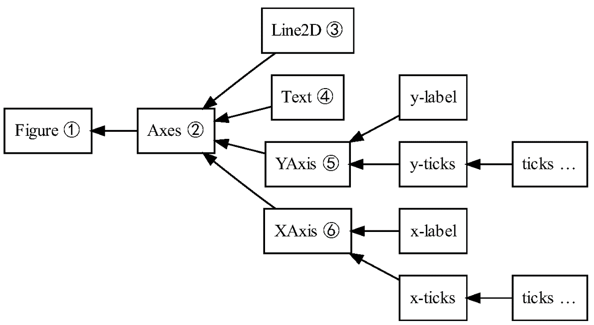
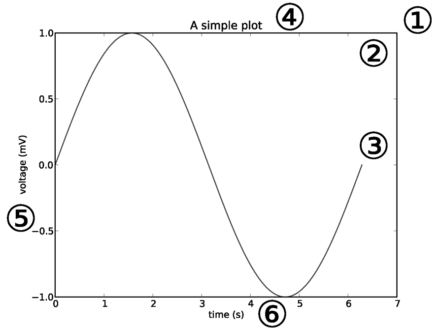
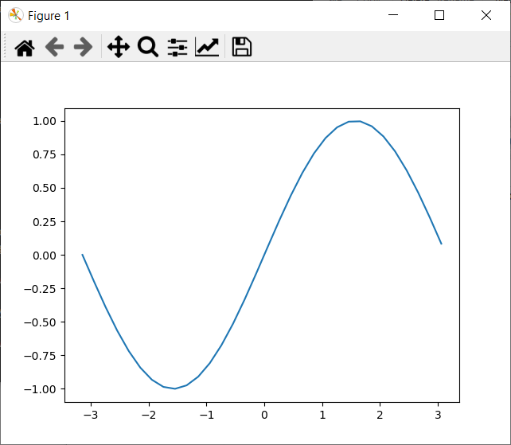
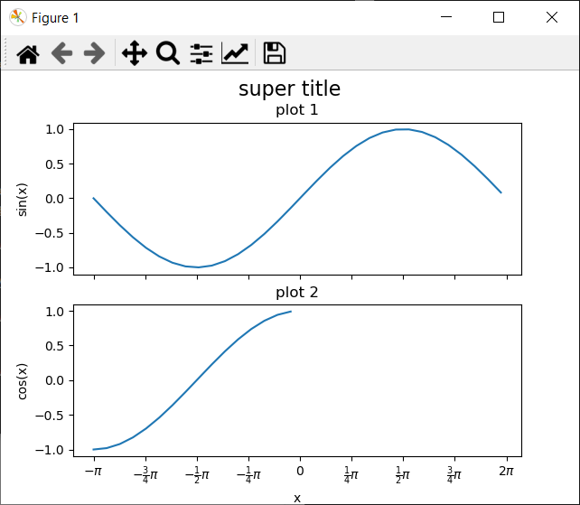
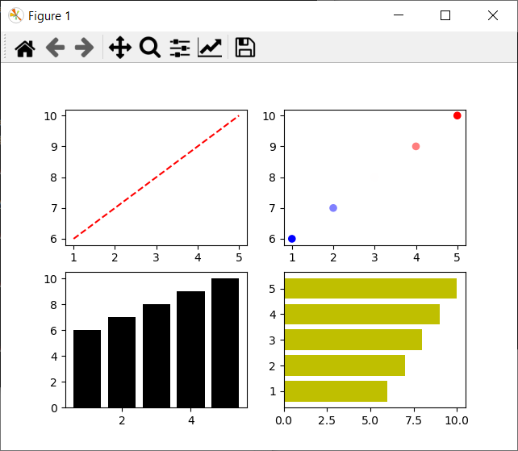

[[WUR Geoscripting](https://geoscripting-wur.github.io/)]{.page-header-title} 

# Python Programing

In the previous tutorial, we learned how to set up virtual environments to write and run python code. In today's tutorial, we will start using these environments in Positron. Next week we will work on analyzing spatial data in python. 

During this tutorial, we will demonstrate different ways to visualize spatial data in both static and interactive formats. This can be done using several open source packages that built upon each other. To understand the functionality of these packages and how they can be integrated, we will refer to the concepts of Object Oriented Programming (OOP). Object Oriented Programming is a way of programming where objects are fundamental building blocks that supports code modularity and reusability. OOP is a common way to re use blocks of code and add to them, especialy in the development of neural netowrks this a common method. Data might be loadeed using a class that has some main functionality, but some custom functions can be added to make the data loader specific to a project.  Therefore, before we go into the visualization part of this tutorial we will begin by explaining Object Oriented Programming. 


## Today’s Learning objectives

-   Vizualize data using Matplotlib and understand the structure matplotlib uses
-   Use cartopy's built in functionality to create maps
-   Add geospatial data to a map using rasterio for rasters, geopandas for vector 

## Dependencies
For the tutorial today we make use of a set of packages. Initialize a new pixi environment with the following packages in it: 

```bash
pixi init python-programming
cd python-programming
pixi add python cartopy geopandas rasterio matplotlib contextily
```

# Object-Oriented Programming in Python
Up until now in this course we have looked at R mainly as a scripting language. We call this way of programming Procedural Programming, where procedures (functions) are called in series of steps. Both Python and R can be used in another programming paradigm: Object Oriented Programming. Object Oriented Programming (OOP) is a way of programming where functionality and information is encapsulated in objects. Instead of assigning values and functions to variables individually, objects are used where both values (properties, attributes) and calculations (functions, methods) can be stored together. This offers several advantages. OOP promotes modularity and re-usability by breaking down complex problems into smaller, manageable units - the objects. These objects can be reused in various parts of the program or even in other projects, leading to more efficient, scalable and organized programming. This is especially important when working on projects containing lots of code. OOP will make your work a lot easier to understand for you and others and it will make it easier to re-use parts of the code.

## How to work with objects in Python
In Python, objects are created and manipulated using classes. A class serves as a blueprint that defines the structure and behavior of an object. It brings together data (properties) and functions (methods) into a single object. To define a class in Python, we use the `class` keyword, followed by the name of the class. Let's take a look at an example of a simple class called `Person`:

```{python}
class Person:
    def __init__(self, name, age):
        self.name = name  # < this is a property
        self.age = age    # < this is also a property
    
    def greet(self):  # < This "function" is a method
        print(f"Hello, my name is {self.name} and I'm {self.age} years old.")
```

In positron, you can create this class by pasting the code above into a .py file, saving it. To run this code, pick your preferred method from the previous tutorial.

However, to walk through the code interactively step by step, it’s better to use a REPL or a Jupyter Notebook. You can start a REPL or open a Jupyter Notebook, paste the code above into a cell, and run it. Note that, even though we selected the interpreter in VS Code earlier for running .py files, Jupyter Notebooks run code through their own kernel, so we need to select the interpreter (python-programming in our case) again here to link the notebook’s kernel to the same environment.

Before we use the class, let’s first examine it. The `Person` class has two properties, `name` and `age`, as well as one method, `greet`. The `greet` method prints a greeting message that includes the person's name and age.

In the provided code, the `__init__` method is a special method known as a *constructor*. It is automatically called when an object (also known as instance of an class) is created from the class. The `self` parameter refers to the instance of the class itself, allowing access to its properties and methods that have been assigned during instance creation or when the class was defined Whenever a method is defined within a `class` (like `greet` method), we give `self` as the first parameter.

To create an instance of the `Person` class, you simply call the class as if it were a function and assign the result to a variable. In REPL or Jupyter Notebook, make sure to run the cell containing the Person class first, then run the code below in later cells to create and use its instances.

```{python}
person1 = Person("Alice", 25)
person2 = Person("Bob", 30)
```

We have created two objects, `person1` and `person2`, which are instances of the `Person` class. Now we can access the properties and call the methods of these objects:

```{python}
print(person1.name)  # Output: Alice
print(person2.age)   # Output: 30
person1.greet()      # Output: Hello, my name is Alice and I'm 25 years old.
person2.greet()      # Output: Hello, my name is Bob and I'm 30 years old.
```

::: {.alert .alert-success}
> **Question 2**: Take a look at the [implementation of a geoseries](https://github.com/geopandas/geopandas/blob/80edc868454d3fae943b734ed1719c2197806815/geopandas/geoseries.py#L79) object in GeoPandas. Don't be intimidated by the amount of code! It is not necessary to understand all of it. At line [948 the plot method is defined](https://github.com/geopandas/geopandas/blob/80edc868454d3fae943b734ed1719c2197806815/geopandas/geoseries.py#L948) it calls the [`plot_series` function as defined here](https://github.com/geopandas/geopandas/blob/80edc868454d3fae943b734ed1719c2197806815/geopandas/plotting.py#L313). What library is used for plotting and what exactly does `self` refer to when the `plot` method is defined?
:::

## Inheritence

You may have noticed that class definitions differ very slightly from what we have learned. In the `GeoSeries` example, the class is defined as follows:

```{python}
from geopandas.base import GeoPandasBase, Series

class GeoSeries(GeoPandasBase, Series):
    pass
```

However, we previously learned to define a class like this:

```{python}
class GeoSeries:
    pass
```

The difference lies in the code within the parentheses, which represents *inheritance*. The class will inherit all the functionality from the classes specified as arguments, in this case, `GeoPandasBase` and `Series`. The `Series` object refers to the [Pandas.Series](https://github.com/pandas-dev/pandas/blob/main/pandas/core/series.py#L243C15-L243C15), which contains thousands of lines of code with various functionality. Therefore, the GeoPandas `GeoSeries` contains all the functionality implemented in Pandas, as well as those from `GeoPandasBase` and `GeoPandas.Series`itself. When new functionality is developed for the `Pandas` package, this is directly available in the `GeoPandas` objects, since we inherit all functionality from pandas.

Phew, that's a lot of complicated code, and it may seem overwhelming. You don't need to understand every detail. The important thing is to grasp the value of classes, objects, and inheritance. When creating a class, we can inherit functionality from another class. How does this work in a simple example?

So, we've learnt that with inheritance, classes can inherit all the functionality from other classes and build upon that. Let's create a new object called `Student`, which will inherit all the properties and methods from the `Person` class we defined earlier. In the end, a student is a person, and it possesses all its characteristics. Paste the code below to a new cell in REPL or Jupyter Notebook and run it.

```{python}
class Student(Person):
    def __init__(self, name, age, student_id):
        super().__init__(name, age)
        self.student_id = student_id
        self.is_studying = False
    
    def study(self):
        self.is_studying = True
        print(f"{self.name} is studying.")
```

In the provided code, the `Student` class inherits from the `Person` class, which we will refer to as the superclass. By doing so, it extends the functionality of the superclass by adding a new property (`student_id`) and a new method (`study`). The `super()` function is used to call the superclass's `__init__` method (in this case from the `Pesron` class), allowing the subclass to initialize the inherited properties.

As a result, the `Student` class contains both the methods and properties inherited from the `Person` class, as well as the additional ones defined within the `Student` class:

```{python}
student = Student("Eve", 22, "123456")
print(student.name)         # Output: Eve
print(student.student_id)   # Output: 123456
student.greet()             # Output: Hello, my name is Eve and I'm 22 years old.
student.study()             # Output: Eve is studying.
```

In this example, `student` is an instance of the `Student` class. It can access the inherited properties from the `Person` class, such as `name`, as well as the newly added property `student_id` and `is_studying`, which defaults to `False`. Similarly, it can invoke both the inherited method `greet` and the additional method `study`, which are specific to the `Student` class. The method `study` prints a message and sets the `is_studying` property to `True`.

::: {.alert .alert-success}
> **Question 3**: Create a new class called `Teacher`. This new class also inherits from `Person`. Define a method for the teacher that checks whether a student is studying. The student should be an input to the method. 
:::


The example of students and persons is straightforward, so let's look at a real world example. [PyTorch](https://docs.pytorch.org) is a package that allows the development of neural networks. Neural networks are the networks used in deep learning, this is not the place to go in depth about deep learning, for now it is enough to understand that a neural network is a model that is trained using data, and stores information in parameters and weights. The data that is used to train the model can be text (in the case of large language models),  images (in image recognition or in sattelite image analysis) or other types of (spatial) data. Since we are often talking about a lot of data, a simple for loop over a path of files is often not sufficient. This is where a the definitions of a `Dataset` and a `DataLoader` come in. In this [data tutorial](https://docs.pytorch.org/tutorials/beginner/basics/data_tutorial.html#creating-a-custom-dataset-for-your-files) from PyTorch, a custom dataset class is defined. This class inherits from the class [`Dataset`](https://docs.pytorch.org/docs/2.13/data.html#torch.utils.data.Dataset), and extends it's functionality with project specific data loading. 

This is an often used way of working in the field of deep learning. Also using a pre-built model and extending it by adding a few layers. Your new model object would then inherit all functionality from another model object, and extend on it by adding functionality. 

# Visualization

Communicating research results is challenging without good visualizations like graphs or more elaborate infographics, and in the case of geospatial data analysis, a map. There are many tools to vizualize data using python, some of them can become very elaborate. 

The most basic and one of the most used tools is *Matplotlib*, a general plotting package. It is used as a base for many other, more tailored packages. One of the core advantages of Matplotlib is that the representation of the figure is separated from the act of rendering it. This enables building increasingly sophisticated features and logic into the figure, a bit like adding many layers to a map in a GIS. Matplotlib can be used to create simple graphs but also maps. Have a look at the [Python Graph Gallery](https://python-graph-gallery.com/matplotlib/) to see some examples, but don't look at the code yet! We will take you through it step by step.

## Matplotlib

In the most basic form plotting is very easy. Look at the code below.

```{python}
import numpy as np
from matplotlib import pyplot as plt

# Create some data
x = np.arange(-np.pi, np.pi, 0.2)
y = np.sin(x)

# Plot x against y
plt.plot(x, y)

# Show the plot
plt.show()
```

In this example, we are using the package numpy to create a series of x values (values from -pi (-3.14) to pi with steps of 0.2, check what this looks like). The y values are the sine of these values. Plotting these values is straightforward. However, as said, Matplotlib is a plotting package where a vizualization object can be created before it is rendered (shown). In the example above, the rendering of the image is only done at the line `plt.show()`. Before this command, we can modify the plot. This allows to add things to the vizualization in steps, layering the complexity. To understand how this works, it is important to understand the hierarchy of the figure object. Have a look at the image below.

::: {#fig-mpl-structure layout-ncol="2"}




Matplotlib hierarchy of figure elements, source <https://www.aosabook.org/en/matplotlib.html>.
:::

The basic elements are the *figure* and the *axes* objects (not to be confused with *Axis* objects!). The figure is like the canvas and the axes is the part of the canvas on which we will make a visualization containing for example an x-axis, y-axis, lines and text. Let's build up a simple line figure as an example.

{width="50%"}

Note that
 the behavior of `plt.show()` depends on how you run the script. If you are using Spyder and want `plt.show()` to work:

1.  Go to Tools.
2.  Go to Preferences.
3.  Select IPython console.
4.  Go to Graphics tab.
5.  In the Graphics backend section, select Automatic as the backend type.
6.  Restart your kernel (go to Console > Restart kernel).

Instead of a single plot, we can add different plots to the figure, for example two. Let's try to add another pot with the cosine values.

```{python}
# Create some data
import numpy as np 

x = np.arange(-np.pi, np.pi, 0.2)
sine = np.sin(x)
cosine = np.cos(x)
```

We can use the subplots method to create a figure and an array of two axes, one for each plot. Check the [subplots documentation](https://matplotlib.org/stable/api/_as_gen/matplotlib.pyplot.subplots.html) to learn more. By using The `sharex` and/or `sharey` argument, we can share axis between different plots for easy comparison between the subplots. Let's initiate the figure and the two axes (don't confuse axis and axes! we are initiating 2 axes, one for each plot) and let the figure share the x-axis.

```{python}
import matplotlib.pyplot as plt 

# Initiate a figure with two subplots 
f, axarr = plt.subplots(2, sharex=True)

```

::: {.alert .alert-success}
> **Question 4**: `axarr` is an array. What are the elements of this array and how many elements does is exist out of?
:::

We can add a title to the figure and labels to the axes. Check [this documentation](https://matplotlib.org/stable/api/axes_api.html) to see what more you can tweak.

```{python}
# Subplots are stored in an array
line = axarr[0].plot(x, sine)
axarr[0].set_title('sine plot')
axarr[1].plot(x, cosine)
axarr[1].set_title('cosine plot')
f.suptitle('This is an image of a two plots', fontsize=16)

```

We looked now at the axes, let's look at the axis as well. We can change the positions of the tick marks to something meaningful in the context of trigonometric functions and customize the labels with regular text or style it using lateX. Check if you understand what object in the hierarchy is edited and why.

```{python}
# Axis label
axarr[1].set_xlabel('x')
axarr[0].set_ylabel('sin(x)')
axarr[1].set_ylabel('cos(x)')


new_ticks = np.arange(-np.pi, np.pi + 0.1, 0.25 * np.pi)
new_labels = [r"$-\pi$", r"$-\frac{3}{4}\pi$",
              r"$-\frac{1}{2}\pi$", r"$-\frac{1}{4}\pi$",
              "$0$", r"$\frac{1}{4}\pi$",
              r"$\frac{1}{2}\pi$", r"$\frac{3}{4}\pi$",
              r"$2\pi$"]
axarr[1].set_xticks(new_ticks)
axarr[1].set_xticklabels(new_labels)
```

Finally! our plot is done for now. We have entered a lot of commands, stacked a lot of different layers to our plot, but we cannot see it yet. using the `plt.show()` command we can see the result!

```{python}
plt.show()
```

Note that if you paste the above code blocks cell by cell in a REPL, you will see the final figure as expected. In Jupyter Notebook, however, you may get nothing at the last step. This is because Jupyter automatically renders and then closes the current figure at the end of each cell, so when you run the last cell with only `plt.show()`, there is no active figure left to display. The easiest solution is to paste all the code into a single cell and run it together!

Alternatively we can use `plt.savefig('filename.png')` instead of showing it. Make sure to create the plot before you run this! `plt.show()` closes and the current plot, so calling savefig after show will result in an empty image. This is useful, otherwise we would keep adding stuff to the same plot.

{width="50%"}

One can create multiple subplots (axes) and use different plotting styles, changing for example the marker style, line style, marker size, and colors, see the example below. For the upper left subplot it is demonstrated how to add a legend; adding a label to the plotted line is essential for this.

```{python}
from matplotlib import pyplot as plt

x = [1, 2, 3, 4, 5]
y = [6, 7, 8, 9, 10]

# New: define number of rows and columns of subplots and unpack them directly 
# into variables that then each contain one axes object
f, ((ax0, ax1), (ax2, ax3)) = plt.subplots(2, 2)

# Dashed line, label for legend, and show the legend on the subplot
ax0.plot(x, y, 'r--', label='red dashed line')
ax0.legend(loc='lower right')

# Scatter plot, using a colormap based on the y-value, changing the marker size to 35
ax1.scatter(x, y, c=y, cmap='bwr', s=35)

# Bar chart, changing the bar color to black
ax2.bar(x, y, color='k')

# Horizontal bar chart, changing the bar color to yellow
ax3.barh(x, y, color='y')
plt.show()
```

{width="50%"}

::: {.alert .alert-success}
> **Question 5**: In the upper right subplot, why is there no point at x=3, y=8?.
:::
There are more types of graphs available, have look at the [Matplotlib documentation](https://matplotlib.org/stable/plot_types/index.html) and play around to find out more! 


## Vizualizing spatial data

So, plotting sine and cosines is fun and all, but this is a course about **geo**scripting, so how is this going to help you making maps? Well, Matplotlib really is fundamental when it comes to plotting things in python. Almost every package that can be used to create static plots (and even some dynamic ones) is based upon or uses Matplotlib, and lots of the logic you just saw will therefore be reused: the figures-, axes- and axis-objects are reused in many packages. As we saw, GeoPandas plot functionality is completely based upon Matplotlib.
We will show you how to create maps using `Cartopy`, a geospatial wrapper around Matplotlib. Have a look at the [definition of the `GeoAxes`](https://github.com/SciTools/cartopy/blob/main/lib/cartopy/mpl/geoaxes.py#L354). What does it inherit from? And what does this mean for its functionality? 

For working with vector data we will use among others `GeoPandas` and for raster data we will use `Rasterio` packages. A more elaborate introduction to these packages will follow in the respective tutorials covering raster and vector analysis. In this tutorial we will use these packages already for reading data, if you do not entirely understand why we do certain things related to these packages, most likely this will be cleared up next week.

For this tutorial, part of the material was taken from the [project pythia](https://foundations.projectpythia.org/core/cartopy/cartopy.html) website, an excellent source for more information and tutorials about working with python! 

## Cartopy
As said, Cartopy is basically adding the spatial component to Matplotlib. Therefore, a lot of the logic will be familiar. By adding spatial information (a coordinate reference system) to an Axes (turning it into a GeoAxes) we can reference our spatial data to each other. Additionally, cartopy has a built-in module to handle the referencing `cartopy.crs`. Let's import these libraries and modules. 

```{python}
import matplotlib.pyplot as plt
from cartopy import crs as ccrs
from cartopy import feature as cfeature
```

Let's start by creating a map of the world. We do this by generating 1 subplot (so just a plot) with the [Plate Carrée](https://en.wikipedia.org/wiki/Equirectangular_projection) projection, a projection where every point is spaced out equally in terms of degrees. 

```{python}
fig = plt.figure(figsize=(11, 8.5))
ax = plt.subplot(1, 1, 1, projection=ccrs.PlateCarree(central_longitude=-75))
ax.set_title("A Geo-referenced subplot, Plate Carree projection")
```

We don't see anything yet! That's because we have not put anything on the map. Let's add the coastline for some spatial context, which can be done by calling a method of the GeoAxes object `ax.coastlines`. 

```{python}
ax.coastlines()
```

coastlines is a special case, apparently showing the coastlines happened so often that a special function was defined. Not everything is this simple sadly... In the [cartopy documentation](https://scitools.org.uk/cartopy/docs/v0.14/matplotlib/feature_interface.html) we can see that there exist pre defined features that we can add using the `add_feature` method from a `GeoAxes`. `ax.add_feature(cfeature.COASTLINE, linewidth=0.3, edgecolor='black')` does the same as `ax.coastlines()` (don't believe it? [Check the source](https://github.com/SciTools/cartopy/blob/75939f9e81ac67838c52ce80230e4431badbeace/lib/cartopy/mpl/geoaxes.py#L609)! ) effectively. Have a look and play around with adding other features! Using the `linewidth` and`edgecolor` arguments we can style the map. Don't forget to `plt.show()` to see the map!

::: {.alert .alert-success}
> **Question 6**: Create a worldwide map with 3 different features, each styled differently. Also add the stockimage to the map. Use [the documentation](https://scitools.org.uk/cartopy/docs/v0.14/matplotlib/geoaxes.html?highlight=stock#cartopy.mpl.geoaxes.GeoAxes.stock_img) to see how.
:::

We have now step by step built up a map in a Pate Carree projection system. However, this projection has some major issues, have you seen [how big Antartica would be at the equator](https://www.thetruesize.com)?! Let's quickly create another map in another projection. In the [documentation](https://scitools.org.uk/cartopy/docs/latest/reference/projections.html) we can find a large list of projections that can be used.

```{python}
fig = plt.figure(figsize=(11, 8.5))
projLae = ccrs.LambertAzimuthalEqualArea(central_longitude=0.0, central_latitude=0.0)
ax = plt.subplot(1, 1, 1, projection=projLae)
ax.set_title("Lambert Azimuthal Equal Area Projection")
ax.coastlines()
ax.add_feature(cfeature.BORDERS, linewidth=0.5, edgecolor='blue')
plt.show()
```

## Local maps
We have seen how to make worldwide maps, let's now make a map, closer to home, with our own data. The polygon data that is shown here is read by `GeoPandas`, directly from a url. The `add_geometries` method reads the geometries from a GeoDataFrame, but can also read geometries from Shapely (more about this in in the Python Vector tutorial). The `set_extent` method is used to define an area of interest, basically it sets the top and bottom left and right corners, so that only the area of interest is shown. Have a look at the code below, the comments explain more line by line.

```{python}
import geopandas as gpd

gdf = gpd.read_file('https://raw.githubusercontent.com/GeoScripting-WUR/PythonProgramming/master/data/gadm41_NLD_2.json')

# Using the dutch coodinate reference system RDNew (epsg code 28992)
crs = ccrs.epsg(28992)

# The data is in another projection as our plot, reprojection to RDnew
gdf = gdf.to_crs(28992)

# Initiate the plot, a little bigger then before
fig = plt.figure(figsize=(15, 15))
ax = plt.subplot(1, 1, 1, projection=crs)
ax.set_title('The municipalities of NL')

# Draw gridlines 
gl = ax.gridlines(
    draw_labels=True, linewidth=2, color='gray', alpha=0.5, linestyle='--'
)

# Set the extent to the extent of the municipalities
min_x, max_x, min_y, max_y = gdf.total_bounds
ax.set_extent((min_x, max_x, min_y, max_y), crs=crs)

# ax.set_extent(gdf.total_bounds, crs=crs) would do this in one step, 
# but the coordinates can be defined seperately as well in this order! 

# Add the geometries to the map
ax.add_geometries(gdf["geometry"], crs=crs, edgecolor = 'black', facecolor = 'None')

plt.show()
```

## Basemaps

Our map of the municipalities is looking a bit empty though, an empty white shape does not give much context to work with. It would be nice to see what's actually there: roads, cities, water, the kind of context you get "for free" on Google Maps. This is called a basemap.

Basemaps are often supplied using map tiles. Cartopy can fetch map tiles itself through `cartopy.io.img_tiles`, but it is fiddly to work with, you need to pick zoom levels by hand and several of the free tile providers it relies on have been discontinued over the years. A more lightweight, purpose built package for this is `contextily`. Remember that a `GeoAxes` [inherits from](https://github.com/SciTools/cartopy/blob/main/lib/cartopy/mpl/geoaxes.py#L354) a regular Matplotlib `Axes`? That means any tool that works on a normal `Axes`, like `contextily`, works on our `GeoAxes` too. So, we can take the exact map we just built above and simply add a basemap to it.

```{python}
import contextily as cx

# add_basemap fetches tiles for the current extent of ax, and reprojects
# them on the fly to whatever crs we give it
cx.add_basemap(ax, crs=28992, zorder=-1)

plt.show()
```

Keep in mind that in this code, we add to the already existing `ax`, reusing the earlier plot from the municipalities. This above codeblock relies on the fact that you ran that code before. 

The image tiles that are used as a basemap in this example are by default available in the web mercator projection (epsg:3857), the crs argument allows for on the fly reprojection to whatever we need, in this case the dutch RD New coordinate system. 

The `zorder` argument controls the stacking order of the different layers on our `GeoAxes`, just like layers in a GIS. Giving the basemap a low `zorder` makes sure it stays behind the municipality polygons we added earlier, instead of covering them up.

::: {.alert .alert-success}
> **Question 7**: By default, `contextily` uses OpenStreetMap tiles. Have a look at the [contextily documentation](https://contextily.readthedocs.io/en/latest/intro_guide.html#Providers) to find another tile provider, and use it instead.
:::

## Plotting rasters
In the case of rasters, we will make use in another way of the widespread use of `Matplotlib` and the `GeoAxes` objects. For rasters we will make use of the package `Rasterio` to handle raster files. In this package a [plot module](https://github.com/rasterio/rasterio/blob/7c83de410b7b812e6552e4b76ce236bb6213c80d/rasterio/plot.py#L34) is defined, that allows for the plotting of rasters. Instead of defining an axes and adding the raster as a feature to the plot, we will create the `Figure` and `GeoAxes` objects using `Cartopy`, and pass them to `Rasterio` `plot.show` function. Other features that we might want to add, we can add still to the same `GeoAxes`, in that way everything will be added to the same canvas. Have a look at the code below. 

```{python}
import requests
import io 
import zipfile 
import rasterio
from rasterio.plot import show
import numpy as np


# These first 4 lines download and unzip a landsat8 image 
# It is not necessary to understand these lines. 
url = 'https://github.com/GeoScripting-WUR/VectorRaster/releases/download/tutorial-data/landsat8.zip'
resp = requests.get(url, "data.zip")
zf = zipfile.ZipFile(io.BytesIO(resp.content))
zf.extractall('./')

#The landsat image is projected in UTM31N, let's use that projection
crs = ccrs.epsg(32631)

# Initiate the area of interest
fig = plt.figure(figsize=(15, 15))
ax = plt.subplot(1, 1, 1, projection=crs)
ax.set_title('The municipalities of NL')

# Read the GeoJson with GeoPandas.
gdf = gpd.read_file('https://raw.githubusercontent.com/GeoScripting-WUR/PythonProgramming/master/data/gadm41_NLD_2.json')
# This time reproject it to UTM31
gdf = gdf.to_crs(32631)
gdf.plot(ax=ax,edgecolor='white', color = 'None')

# Open the raster using rasterio, more about rasterio next week!
dataset = rasterio.open('./LC81970242014109LGN00.tif')

# This is a Landsat 8 image with 7 bands. For a true-color image we want
# the Red, Green and Blue bands, which for Landsat 8 are bands 4, 3 and 2.
rgb = dataset.read((4, 3, 2))

# Most valid pixels fall between 0 and 1500, with a long tail. Clipping to 
# that range and rescaling to 0-1 to make the image brighter
rgb = np.clip(rgb, 0, 1500) / 1500


show(rgb, transform=dataset.transform, ax=ax)
```

Remember to show or save the image! For this, run `plt.show()` to show the image, or `plt.savefig('filename.png')` to save the image.

# What have we learned?

You finished this tutorial, well done!
We started with a short introduction about object oriented programming and you now know what objects are, how they are implemented in python and how they can inherit functionality from each other. In this way we can stand on top of the shoulders of giants, we do not have to write the same code somebody else already has. 

Next Matplotlib was introduced, you now know what the structure of a Matplotlib plot is, how different elements are organized on a figure and how to add data to a plot. 

Building on that, we looked at Cartopy, building on top of Matplotlib, illustrating object oriented programming and showing it's power. We made basic maps using all built in functionality, and we also saw how to add our own data to maps both vector and raster. Because a `GeoAxes` is still a Matplotlib `Axes`, we could also drop in `contextily` to add a basemap without any extra work, another example of reusing code somebody else already wrote.

What you learned today is only a tip of the iceberg. For more elaborate plots and other examples, visit the Pythia project and the cartopy gallery, both listed below! 


# More info

-   [Official Python tutorial](https://docs.Python.org/3/contents.html)
-   [Python Style guide](https://www.python.org/dev/peps/pep-0008/)
-   [Python 3 Cheatsheet](https://ugoproto.github.io/ugo_py_doc/py_cs/)
-   [Overview Python package Cheatsheets](https://www.datacamp.com/community/data-science-cheatsheets?tag=python)
-   [Project Pythia](https://foundations.projectpythia.org/core/cartopy/cartopy.html)
-   [Cartopy examples](https://scitools.org.uk/cartopy/docs/latest/gallery/index.html)
